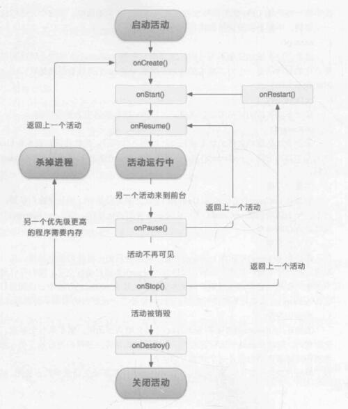

- [0、Android 生成 APK 的过程](#0android-生成-apk-的过程)
- [1、android.graphics.drawable.Drawable](#1androidgraphicsdrawabledrawable)
  - [官方解释](#官方解释)
  - [Drawable 作用于 View](#drawable-作用于-view)
  - [Drawable 的常用子类](#drawable-的常用子类)
- [2、Android 四大组件](#2android-四大组件)
  - [Activity](#activity)
  - [Service](#service)
  - [Content Provider](#content-provider)
  - [Broadcast Receiver](#broadcast-receiver)
  - [重要组件 Intent](#重要组件-intent)
- [3、活动的生命周期](#3活动的生命周期)
- [4、活动的启动模式](#4活动的启动模式)
  - [standard](#standard)
  - [singleTop](#singletop)
  - [singleTask](#singletask)
  - [singleInstance](#singleinstance)
- [5、广播机制](#5广播机制)
  - [标准广播](#标准广播)
  - [有序广播](#有序广播)
- [6、数据持久化技术](#6数据持久化技术)
  - [文件存储](#文件存储)
  - [SharedPreferences](#sharedpreferences)
  - [SQLite 数据库存储](#sqlite-数据库存储)
- [7、Handler 的原理](#7handler-的原理)
- [8、Android ANR](#8android-anr)
  - [ANR 产生的原因](#anr-产生的原因)
  - [ANR 的类型](#anr-的类型)
  - [如何避免 ANR](#如何避免-anr)
- [9、](#9)

# 0、Android 生成 APK 的过程
(1) 打包 res 资源文件，生成 R.java 文件  
(2) 处理 AIDL 文件（Android Interface Definition Language），生成对应 java 文件  
(3) 使用 javac 命令编译工程源代码和上面的 java 文件，生成 class 文件  
(4) 将 class 文件和第三方 jar 包打成 classes.dex 文件  
(5) 打包生成 apk  
(6) 通过 jarsigner 对 apk 文件进行签名  
(7) 利用 zipalign 工具对 apk 进行字节对齐优化操作

# 1、android.graphics.drawable.Drawable
## 官方解释
Drawable 是一个抽象类，是 “所有可绘制东西” 的一个抽象，大多数时候，我们只需要把各种不同类型的资源作为转化为 drawable，然后 View 会帮我们把它渲染到屏幕上。Drawable 类提供了一个通用 API，用于解析转化各种可视资源到 Canvas，跟 View 不一样，Drawable 不能接受任何事件以及用户交互。

## Drawable 作用于 View
通过 View 的 setBackgroundColor 方法可以设置颜色为 View 的背景。比如：
```
button.setBackgroundColor(Color.YELLOW);
```
也可以用自定义的shape作为背景。先用先用 xml 自定义一个圆角空心描边矩形 shape ：
```
<shape
     android:shape="rectangle">
    <corners android:radius="4dp"/>
    <solid android:color="#fff"/>
    <stroke android:color="#ef6f06" android:width="1dp"/>
</shape>
```
然后通过 setBackgroundResource 进行设置
```
button.setBackgroundResource(R.drawable.bk_normal);
```

下面是 Drawable 的几个抽象方法：
```
public abstract void draw(@NonNull Canvas canvas);
public abstract void setAlpha(@IntRange(from=0,to=255) int alpha);
public abstract void setColorFilter(@Nullable ColorFilter colorFilter);
public abstract @PixelFormat.Opacity int getOpacity();
```
可以看到 draw 方法的参数中有一个 canvas 对象。可以理解为，View 通过 setBackground 方法为自己设置了一个 drawable 对象后，而 drawable 又有一个 draw 方法，那么 View 绘制自己的背景时，直接调用 drawable 对象的的 draw 方法，这个 draw 方法需要一个 canvas 对象，这里可直接把 View 的 Canvas 对象传递过去，那么 Drawable 就可以成功的把自己的绘制内容应用到 View 之上。

## Drawable 的常用子类
* ColorDrawable：使用指定的颜色来填充画布。  
* GradientDrawable：表示一个渐变区域，可以实现线性渐变、发散渐变和平铺渐变等渐变效果。  
*BitmapDrawable：对 bitmap 的一种包装，可以设置它包装的 bitmap 在 BitmapDrawable 区域内的绘制方式，如平铺、拉伸填充或者保持图片原始尺寸。  
* AnimationDrawable：实现 Android 帧动画，动画效果需要在 java 代码中开启。  
* StateListDrawable：对应于 xml 中的 selector，是开发中经常使用的 Drawable 子类，比如一个按钮正常状态和按下时候不同的样式就是用 StateListDrawable 实现的。  
* InsetDrawable：包含一个 Drawble 实例，通过设置 inset 属性值来定义插入的 Drawable 实例与自身四边的距离。当我们需要设置一个视觉尺寸小于 View 尺寸的背景，InsetDrawable 就能派上用场了。

# 2、Android 四大组件
## Activity
一个 Activity 通常展现为一个可视化的用户界面。比如，一个 activity 可能展现为一个用户能够选择的菜单项列表或者展现一些图片以及图 片的标题。一个消息服务应用程序可能包括一个显示联系人列表的 activity,一个编写信息的 activity，以及其他一些查看信息和改动应用程序设 置的 activity。尽管这些 activity 一起工作，共同组成了一个应用程序，但每个 activity 都是相对独立的。

一个应用程序可能仅仅包括一个 activity，或者像上面提到的消息服务程序一样有多个 activity。一个应用程序包括几个 activity 以及各个 activity 完毕什么样的功能全然取决于应用程序以及它的设计。通常每一个应用程序都包括一个在应用程序启动后第一个展现给用户的 activity。在当前展现给用户的 activity 中启动一个新的 activity，能够实现从一个 activity 转换到另外一个 activity。

## Service
Service 是 Android 的四大组件之中的一个，即 Android 系统的服务（不是一个线程，是主程序的一部分），与 Activity 不同，它是不能与用户交互的，不能自己启动的，须要调用 Context.startService() 来启动，执行后台，假设我们退出应用时，Service 进程并没有结束，它仍然在后台运行。

service 没实用户界面，但它会在后台一直执行。比如，service 可能在用户处理其他事情的时候播放背景音乐，或者从网络上获取数据，或者执行一些运算，并把运算结构提供给 activity 展示给用户。每一个 service 都扩展自类 Serivce。

多媒体播放器播放音乐是应用 service 的一个很好的样例。多媒体播放器程序可能含有一个或多个 activity，用户通过这些  activity 选择并播放音乐。然而，音乐回放并不须要一个 activity 来处理，由于用户可能会希望音乐一直播放下去，即使退出了播放器去执行其他 程序。为了让音乐一直播放，多媒体播放器 activity 可能会启动一个 service 在后台播放音乐。Android 系统会使音乐回放 service 一直执行，即使在启动这个 service 的activity 退出之后。

## Content Provider
ContentProvider（内容提供者）是 Android 中的四大组件之中的一个。主要用于对外共享数据，也就是通过 ContentProvider 把应用中的数据共享给其它应用訪问，其它应用能够通过 ContentProvider 对指定应用中的数据进行操作。 ContentProvider 分为系统的和自己定义的，系统的也就是比如联系人，图片等数据。

## Broadcast Receiver
广播（Broadcast）是在组件之间传播数据的一种机制，这些组件可以位于不同的进程中，起到进程间通信的作用

BroadcastReceiver 是对发送出来的 Broadcast 进行过滤、接受和响应的组件。首先将要发送的消息和用于过滤的信息（Action，Category）装入一个 Intent 对象，然后通过调用 Context.sendBroadcast() 、 sendOrderBroadcast() 方法把 Intent 对象以广播形式发送出去。

## 重要组件 Intent
Android 中提供了 Intent 机制来协助应用间的交互与通讯，Intent 负责对应用中一次操作的动作、动作涉及数据、附加数据进行描述，Android 则根据此 Intent 的描述，负责找到对应的组件，将 Intent 传递给调用的组件，并完成组件的调用。Intent 不仅可用于应用程序之间，也可用于应用程序内部的 Activity/Service 之间的交互。因此，Intent 在这里起着一个媒体中介的作用，专门提供组件互相调用的相关信息，实现调用者与被调用者之间的解耦。

# 3、活动的生命周期


# 4、活动的启动模式
## standard
是活动默认的启动模式。每启动一个新的活动，便会创建一个该活动的实例并进入返回栈，使其处于栈顶的位置。

## singleTop
在启动活动时如果发现返回栈的栈顶已经是该活动，则直接使用它，不创建新的活动实例。

## singleTask
每启动一个活动时先检查返回栈中是否有该活动的实例。若有，则直接使用该实例，并把在这个活动实例之上的活动实例统统出栈；若没有，则创建新的活动实例。

## singleInstance
launchMode 被指定为 singleInstance 模式的活动会启用一个新的返回栈来管理这个活动，能够解决多个应用程序共享实例的问题。

# 5、广播机制
Android 提供了一套完整的 API ，允许应用程序自由地发送和接收广播。接收广播需要广播接收器（Broadcast Receiver）。

Android 中的广播主要可以分为两种类型：<b>标准广播</b>和<b>有序广播</b>。

## 标准广播
是一种完全异步执行的广播。在广播发出后，所有的广播接收器几乎都在同一时刻接收到这条广播消息，它们之间没有任何先后顺序可言。这种广播效率比较高，但同时也意味着它是无法被截断的。

## 有序广播
是一种同步执行的广播。在广播发出后，同一时刻只有一个广播接收器能够收到这条广播消息，当这个广播接收器的逻辑执行完毕后，广播才会继续传递，此时的广播接收器是由先后顺序的，优先级高的广播接收器就可以收到广播消息，并且可以截断正在传递的广播。

Android 内置了很多系统级别的广播，我们可以在应用程序中通过监听这些广播来得到各种系统的状态信息。比如手机开机完成后会发出一条广播，电池电量变化会发出一条广播，时间或时区发生改变也会发出一条广播，等等。如果想要接受这些广播，就需要使用广播接收器。

# 6、数据持久化技术
Android 系统中主要提供三种方式用于简单地实现数据持久化功能：
* 文件存储
* SharedPreferences 存储
* 数据库存储

这三种方式比直接把数据存到手机的SD卡中会更简单、安全。

## 文件存储
是 Android 中最基本的一种数据存储方式，不对存储的内容进行任何的格式化处理，所有的数据都是原封不动地保存到文件当中

## SharedPreferences
SharedPreferences 是使用键值对的方式来存储数据的。Android 中主要提供三种方法来得到 SharedPreferences 对象：
* Context 类中的 getSharedPreferences 方法
* Activity 类中的 getPreferences 方法
* PreferenceManager 中的 getDefaultSharedPreferences 方法

## SQLite 数据库存储
是 Android 系统内置的轻量级关系型数据库，占用资源很少，特别适合在移动设备上使用。它不仅支持标准的 SQL 语法，还遵循数据库的 ACID 事务。

Android 提供了 SQLiteOpenHelper 抽象类来让我们管理数据库。我们需要实现它的两个抽象方法，分别是 onCreate() 和 onUpgrade()，然后分别在这两个方法中去实现创建、升级数据库的逻辑。

SQLiteOpenHelper 中还有两个非常重要的实例方法：getReadableDatabase() 和 getWriteableDatabase()。这两个方法分别创建或打开一个现有的数据库，并返回一个对数据库进行读写的对象。

# 7、Handler 的原理
Message 是一个数据模型，可以携带少量数据在线程之间传递

Handler 用于发送和接受消息，有三个主要方法：
```
sendMessage();
dispatchMessage();
handleMessage();
```
Handler 使用 sendMessage 方法会把消息压入消息队列中
```
public class Handler {

    private MessageQueue mQueue;
    private Looper mLooper;

    // Handler的初始化在主线程中完成
    public Handler(){
        // 获取主线程的looper对象
        mLooper = Looper.myLooper();
        this.mQueue = mLooper.mQueue;
    }

    // 发送消息，压入队列
    public void sendMessage(Message msg){
        msg.target = this;
        mQueue.enqueueMessage(msg);
    }

    // 内部调用，外部实现
    public void handleMessage(Message msg){

    }

    // 转发
    public void dispatchMessage(Message msg){
        handleMessage(msg);
    }
}
```
MessageQueue 是消息队列，存放所有 Handler 发送过来的消息，这些消息会一直存放在消息队列中等待处理。

Looper 通过调用 loop() 方法进入一个无限循环，每当发现消息队列中有消息，就会把它取出，并传递到 Handler 的 handleMessage() 方法中

# 8、Android ANR
ANR 的全称是 Application Not Responding（应用程序无响应）

## ANR 产生的原因
* UI 线程执行了耗时操作，比如数据库操作或网络、I/O 操作
* 其他程序占用 CPU 导致本进程得不到 CPU 时间片

## ANR 的类型
* KeyDispatchTimeout：最常见的类型，View 的点击事件或触摸事件在 5 秒内没有响应
  ```
    // How long we wait until we timeout on key dispatching.
    static final int KEY_DISPATCHING_TIMEOUT = 5*1000;
  ```
* BroadcastTimeout：广播的超时时间，分别 FG 和 BG，分别是 10 秒和 60 秒
  ```
    // How long we allow a receiver to run before giving up on it.
    static final int BROADCAST_FG_TIMEOUT = 10*1000;
    static final int BROADCAST_BG_TIMEOUT = 60*1000;
  ```
* ServiceTimeout：Service 的各个生命周期函数在特定时间（20秒）内无法完成处理
  ```
    // How long we wait for a service to finish executing.
    static final int SERVICE_TIMEOUT = 20*1000;
 
    // How long we wait for a service to finish executing.
    static final int SERVICE_BACKGROUND_TIMEOUT = SERVICE_TIMEOUT * 10;
  ```

## 如何避免 ANR
* UI 线程尽量只做跟 UI 相关的工作
* 耗时的操作，如 I/O、网络连接，放到单独的线程处理
* 尽量用 Handler 处理 UI 线程和非 UI 线程之间的交互

# 9、