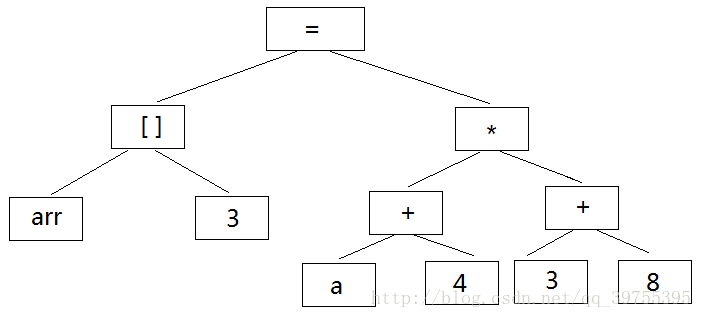
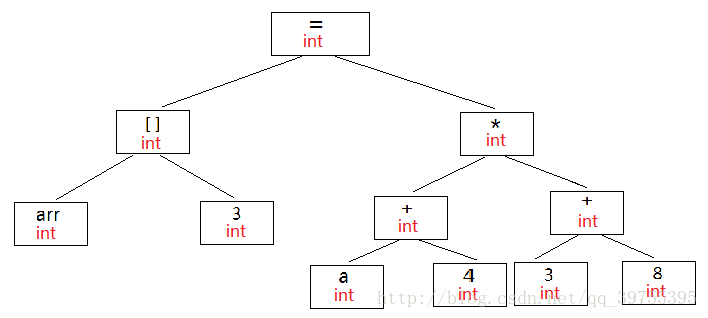
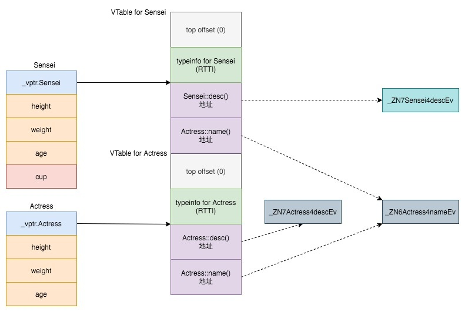

- [0、C++ 中传指针与传引用的比较](#0c-中传指针与传引用的比较)
- [1、C 程序从源代码到可执行程序所经历的过程](#1c-程序从源代码到可执行程序所经历的过程)
  - [预处理](#预处理)
  - [编译](#编译)
  - [汇编](#汇编)
  - [链接](#链接)
- [2、C 中 const 和 #define 的区别](#2c-中-const-和-define-的区别)
  - [类型检查](#类型检查)
  - [编译器的处理](#编译器的处理)
  - [在内存中的存储方式](#在内存中的存储方式)
  - [效率](#效率)
- [3、内联函数](#3内联函数)
  - [一些不会被内联的情况](#一些不会被内联的情况)
- [4、malloc/free 和 new/delete](#4mallocfree-和-newdelete)
  - [malloc/free](#mallocfree)
  - [new/delete](#newdelete)
  - [两者的区别](#两者的区别)
- [5、C++ 中的多态与（纯）虚函数](#5c-中的多态与纯虚函数)
- [6、GCC 编译优化选项](#6gcc-编译优化选项)
# 0、C++ 中传指针与传引用的比较
当把引用作为参数传递的过程中，形式参数会作为局部变量在栈中开辟内存空间，存放的是实参变量的地址，对形参的任何操作都会被处理为间接寻址，即通过存放的这个地址去访问主调函数的实参变量。

指针是一个实体，引用只是一个别名。引用不能为空，因此引用在定义时必须初始化，一旦引用一个实体，就不能再引用另一个实体。而指针指向的内容可以为空。

引用是类型安全的，在引用过程中会进行类型检查。而指针则不会。

知乎上“引用不能防止空引用”的论调：
```
void func(A& );
A* a = NULL;
func(*a);     // 空引用，但编译期间无法检查
```

# 1、C 程序从源代码到可执行程序所经历的过程
预处理 -> 编译 -> 汇编 -> 链接

## 预处理
预处理是一种展开，下面是一些常用的预处理命令

 <center>预处理名称</center> | <center>作用</center> | 
:-:|:-|
#define|宏定义|
#undef|取消宏定义|
#include|使另一源文件嵌入到带有 #include 的源文件中|
#if|条件编译语句|
#else|条件编译语句|
#elif|条件编译语句|
#endif|条件编译语句|
#ifdef|条件编译语句|
#ifndef|条件编译语句|
#error|编译程序时，只要遇到 #error 就会生成一个编译错误的提示消息，并停止编译|
#pragma|指示编译器完成一些特定的动作。如 #pragma message 自定义编译信息输出到终端，#pragma once 防止头文件被多次包含，#pragma pack 指定了内存对齐的方式（对 #pragma 指令作用于预处理阶段还是编译阶段存疑）

## 编译
将经过预处理之后的程序转换成特定汇编代码的过程
* 词法分析：利用类似于“有限状态机”的算法，将源代码程序输入到扫描机中，将其中的字符序列分割成一系列的记号
* 语法分析：语法分析器对扫描器产生的记号进行语法分析，产生语法树。语法树是一种以表达式为节点的树。如赋值表达式、加法表达式、乘法表达式、数组表达式和括号表达式组成的复杂表达式。yacc可以实现语法分析，根据用户给定的规则（不同的编程语言对应不同的语法规则）对记号表进行解析

* 语义分析：语义分析器则对表达式是否有意义进行判断，其分析的语义是静态语义——在编译期能分期的语义（相对的，动态语义是在运行期才能确定的语义）。静态语义通常包括：声明和类型的匹配，类型的转换等。语义分析就会对这些方面进行检查，例如将一个 int 型赋值给 int* 型时，语义分析程序会发现这个类型不匹配，编译器就会报错。经过语义分析阶段之后，所有的符号都被标识了类型（如果有些类型需要做隐式转化，语义分析程序会在语法树中插入相应的转换节点）见下图：  

* 优化：
* 目标代码生成：生成一系列的汇编代码
* 目标代码优化：对汇编代码进行优化

## 汇编
将汇编代码转换成机器码，产生目标文件

## 链接
生成可执行代码

# 2、C 中 const 和 #define 的区别
## 类型检查
const 修饰的量有数据类型，编译器会对该量进行类型检查；#define 则只是简单的文本替换，不涉及类型检查，可能产生不可预料的错误

## 编译器的处理
#define 是在预处理的阶段被处理的，而 const 是在编译阶段被处理的

## 在内存中的存储方式
#define 仅仅只是文本替换，有几个地方被使用则替换几次，不涉及内存分配；const 常量会被保存到符号表中，被作为其他变量的值时会相应地分配一次内存
```
#define MACRO 123
const int INF = 100000000;    // 定义常量，编译时未分配内存
int main() {
    int a = MACRO;    // 预处理时进行宏替换，编译时分配内存
    int b = INF;      // 此时为 INF 分配内存
    int c = INF;      // 不分配内存
}
```

## 效率
？

# 3、内联函数
在 C 语言中，如果一些函数被频繁调用，不断地有函数入栈，即函数栈，会造成栈空间或栈内存的大量消耗。

为了解决这个问题，特别的引入了 inline 修饰符，表示为内联函数。

```
inline function (int i) {
    return i*i;
}
```

使用 inline 修饰带来的好处我们表面看不出来，其实在内部的工作就是在每个调用内联函数地方都换成了函数体的代码，这样就避免了频繁调用函数对栈内存重复开辟所带来的消耗。

内联函数有点像宏，但是宏是由预处理期进行宏替换，而内联函数是通过编译器来控制的。而且内联函数是真正的函数，只是在需要用到的时候，内联函数像宏一样的展开，所以取消了函数的参数压栈，减少了调用的开销。

## 一些不会被内联的情况
* 包含了递归、循环
* 通过函数指针调用内联函数
* 构造函数和析构函数
* 内联函数调用了其他函数

# 4、malloc/free 和 new/delete
## malloc/free
malloc/free 是 C 语言的标准库函数，用于动态申请内存和释放内存

函数原型
```
// 分配 heap 中的 NumBytes 个字节，如果分配成功则返回指向这块内存的指针，如果分配失败则返回 NULL
// 必须检查是否分配成功！
void* malloc(long NumBytes);

// 释放 FirstByte 指向的那块内存，使该内存又可以被使用
void free(void* FirstByte);
```
需要注意的有：
* malloc 函数分配的空间实际会比 NumBytes 稍大一些，多出来的空间用来存储一些内存管理信息，如分配块的长度等
* free 释放的是那块内存，而指针变量 FirstByte 的值并没有变化，也就是说它指向的仍然是那块内存，只是 free 之后那块内存你不能够再使用了。比如下面的程序是可以正确运行的：
  ```
    int* p = NULL;

	p = (int*) malloc(sizeof(int));
	*p = 1;
	printf("%d", *p);
	free(p);

	p = (int*) malloc(sizeof(int));
	*p = 1;
	printf("%d", *p);
	free(p);
  ```

## new/delete
与 malloc/free 不同的是，new/delete 并不是函数（sizeof 也不是），而是 C++ 定义的关键字
* new：分配内存空间，并调用一个或多个构造函数来构建对象
* delete：为将被释放的内存的对象调用一个或多个析构函数，然后释放内存
* 如果在 new 的时候使用了 []，则 delete 的时候也要使用 []

## 两者的区别
* malloc/free 是 C 的标准库函数，而 new/delete 是 C++ 的运算符
* new 是类型安全的，而 malloc 不是。比如：
  ```
  int* p = new float[2];     // 编译器能够发现错误
  int* p = (int*) malloc(2 * sizeof(float));     // 编译器不能发现错误
  ```
* 分配失败时的返回值不同。malloc 返回空指针 NULL，new 则会抛出 std::bad_alloc 异常

# 5、C++ 中的多态与（纯）虚函数
C++ 中的多态以虚函数来实现。在派生类中重写虚函数，运行时会根据对象的类型来调用相应的函数。如果对象类型是派生类，就调用派生类的函数，如果对象类型是基类，就调用基类的函数。

事实上，C++ 中类和操作的封装只是对于程序员而言的。而编译器编译之后其实还是面向过程的代码。编译器帮你给成员函数增加一个额外的类指针参数，运行期间传入对象实际的指针。**类的数据（成员变量）和操作（成员函数）其实还是分离的。**

在类不含有虚函数的情况下，编译器在编译期间就会就会把函数的地址确定下来，运行期间直接去调用这个地址的函数即可。这种函数调用方式也就是所谓的**静态绑定**（static binding）。

虚函数的出现其实就是为了实现面向对象三个特性之一的**多态**。若使用虚函数，用父类指针指向子类的地址，最终调用的函数还是调用子类的。这个现象称之为**动态绑定**（dynamic binding）或者**延迟绑定**（lazy binding）。而如果把虚函数前面的 `virtual` 关键字去掉，代码最终将调用父类的函数，这是为什么呢？指针实际指向的还是子类对象的内存空间，可是为什么不能调用到子类的函数？这个就是我在第一部分说过的：类的数据（成员变量）和操作（成员函数）其实是分离的。仅从对象的内存布局来看，只能看到成员变量，看不到成员函数。因为调用哪个函数是编译期间就确定了的，编译期间只能识别父类的函数。

接下来就涉及虚函数表的问题。在含有虚函数的类编译期间，编译器会自动给这种类在起始位置追加一个虚表指针（称之为：vptr），vptr 指向一个虚表（称之为：vtable 或 vtbl），虚表中存储了实际的函数地址。所有虚函数的的调用取的是哪个函数（地址）是在运行期间通过查虚表确定的。



在上图中可以看到，子类 `Sensei` 和父类 `Actress` 的对象内存中都有一个指向虚函数表的指针，两个对象的虚函数表连在一起。其中 `Actress::desc()` 和 `Actress::name()` 都是虚函数，但是子类 `Sensei` 只重写了前者。因此在调用 `name()` 函数时使用的仍然是父类的

纯虚函数只有声明，没有定义，并且需要在末尾加上 `= 0`。含有纯虚函数的类称为抽象类。

# 6、GCC 编译优化选项
GCC 提供了大量编译优化选项，对编译时间、目标文件长度、执行效率三个维度进行不同程度的取舍

GCC 常用编译选项：
* -c：只编译并生成目标文件
* -E：只运行 C 预编译器
* -g：生成调试信息
* -Os：相当于 -O2.5
* -o FILE：生成指定的输出文件，用于生成可执行文件时
* -O0：无优化
* -O(-O1)：在不影响编译速度的前提下，尽量采用一些优化算法降低代码大小和可执行代码的运行速度，并开启如下的优化选项：
  ```
  -fauto-inc-dec 
  -fbranch-count-reg 
  -fcombine-stack-adjustments 
  -fcompare-elim 
  -fcprop-registers 
  -fdce 
  -fdefer-pop 
  -fdelayed-branch 
  -fdse 
  -fforward-propagate 
  -fguess-branch-probability 
  -fif-conversion2 
  -fif-conversion 
  -finline-functions-called-once 
  -fipa-pure-const 
  -fipa-profile 
  -fipa-reference 
  -fmerge-constants 
  -fmove-loop-invariants 
  -freorder-blocks 
  -fshrink-wrap 
  -fshrink-wrap-separate 
  -fsplit-wide-types 
  -fssa-backprop 
  -fssa-phiopt 
  -fstore-merging 
  -ftree-bit-ccp 
  -ftree-ccp 
  -ftree-ch 
  -ftree-coalesce-vars 
  -ftree-copy-prop 
  -ftree-dce 
  -ftree-dominator-opts 
  -ftree-dse 
  -ftree-forwprop 
  -ftree-fre 
  -ftree-phiprop 
  -ftree-sink 
  -ftree-slsr 
  -ftree-sra 
  -ftree-pta 
  -ftree-ter 
  -funit-at-a-time
  ```
* -O2：牺牲部分编译速度，除了执行-O1所执行的所有优化之外，还会采用几乎所有的目标配置支持的优化算法，用以提高目标代码的运行速度，同样会开启大量优化选项
* -O3：除了执行 -O2 所有的优化选项之外，一般都是采取很多向量化算法，提高代码的并行执行程度，利用现代 CPU 中的流水线， Cache 等，并开启一些优化选项
* -Os：这个优化标识和 -O3 有异曲同工之妙，当然两者的目标不一样，-O3 的目标是宁愿增加目标代码的大小，也要拼命的提高运行速度，但是这个选项是在 -O2 的基础之上，尽量的降低目标代码的大小，这对于存储容量很小的设备来说非常重要。为了降低目标代码大小，会禁用下列优化选项，一般就是压缩内存中的对齐空白(alignment padding)
* -Ofast：该选项将不会严格遵循语言标准，除了启用所有的 -O3 优化选项之外，也会针对某些语言启用部分优化。如：-ffast-math ，对于 Fortran 语言，还会启用下列选项：
  ```
  -fno-protect-parens 
  -fstack-arrays
  ```
* -Og：该标识会精心挑选部分与 -g 选项不冲突的优化选项，当然就能提供合理的优化水平，同时产生较好的可调试信息和对语言标准的遵循程度