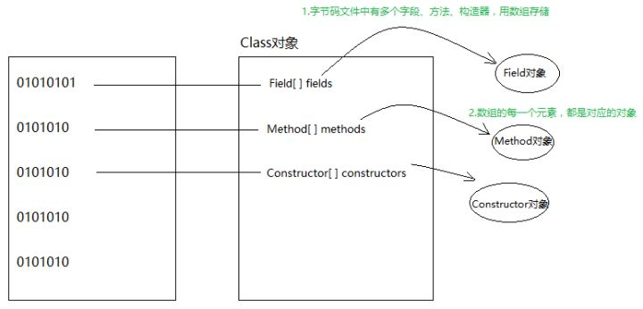

- [0、JVM Garbage Collection](#0jvm-garbage-collection)
  - [垃圾判断算法](#垃圾判断算法)
    - [(1) 引用计数法](#1-引用计数法)
    - [(2) 可达性分析算法（标记法）](#2-可达性分析算法标记法)
  - [垃圾回收算法](#垃圾回收算法)
    - [(1) 标记-清除法](#1-标记-清除法)
    - [(2) 压缩法](#2-压缩法)
    - [(3) 复制法](#3-复制法)
  - [内存模型与回收策略](#内存模型与回收策略)
- [1、java.util.HashMap](#1javautilhashmap)
  - [基本介绍](#基本介绍)
  - [源码分析](#源码分析)
- [2、HashCode()](#2hashcode)
- [3、final](#3final)
  - [(1) final 类](#1-final-类)
  - [(2) final 方法](#2-final-方法)
  - [(3) final 变量](#3-final-变量)
- [4、String、StringBuilder、StringBuffer 异同](#4stringstringbuilderstringbuffer-异同)
  - [(1) String](#1-string)
  - [(2) StringBuilder](#2-stringbuilder)
  - [(3) StringBuffer](#3-stringbuffer)
- [5、java 内存管理（栈、堆、静态域、常量池...)](#5java-内存管理栈堆静态域常量池)
- [6、抽象类](#6抽象类)
- [7、java.util.Collection](#7javautilcollection)
- [8、java.util.Collections](#8javautilcollections)
- [9、java.util.HashSet 源码分析](#9javautilhashset-源码分析)
- [10、java.util.ArrayList 源码分析](#10javautilarraylist-源码分析)
- [11、java.util.concurrent.ConcurrentHashMap](#11javautilconcurrentconcurrenthashmap)
- [12、异常 Exception](#12异常-exception)
  - [可检查异常](#可检查异常)
  - [不可检查异常](#不可检查异常)
  - [自定义异常](#自定义异常)
- [13、java 进程和线程](#13java-进程和线程)
- [14、java.lang.Thread](#14javalangthread)
- [15、接口和抽象类](#15接口和抽象类)
  - [接口](#接口)
  - [抽象类](#抽象类)
  - [接口和抽象类的区别](#接口和抽象类的区别)
  - [什么时候用接口，什么时候用抽象类？](#什么时候用接口什么时候用抽象类)
- [16、static{} 语句块](#16static-语句块)
- [17、java 中的单例模式](#17java-中的单例模式)
  - [懒汉式](#懒汉式)
  - [加锁的懒汉式](#加锁的懒汉式)
  - [饿汉式](#饿汉式)
  - [双重锁](#双重锁)
  - [静态内部类/登记式](#静态内部类登记式)
  - [枚举](#枚举)
- [18、volatile 关键字](#18volatile-关键字)
  - [volatile 保持原子性吗？](#volatile-保持原子性吗)
- [19、Java 内存模型（JMM）](#19java-内存模型jmm)
  - [8 种同步操作](#8-种同步操作)
- [20、synchronize 关键字](#20synchronize-关键字)
- [21、Java 四种引用类型](#21java-四种引用类型)
  - [强引用](#强引用)
  - [软引用](#软引用)
  - [弱引用](#弱引用)
  - [虚引用](#虚引用)
- [22、Java 中的多态](#22java-中的多态)
  - [多态的三个必要条件](#多态的三个必要条件)
  - [实现方式](#实现方式)
- [23、Java 反射](#23java-反射)
- [24、Java Object 类](#24java-object-类)
- [25、Protobuf](#25protobuf)
- [26、Java 中的基本数据类型](#26java-中的基本数据类型)

# 0、JVM Garbage Collection
## 垃圾判断算法
### (1) 引用计数法
给每个对象添加一个计数器，当有地方引用该对象时计数器加 1，当引用失效时计数器减 1。用对象计数器是否为 0 来判断对象是否可被回收。

缺点：变量值被关联次数的增加或减少，都会引发引用计数机制的执行，这明显存在效率问题；无法解决交叉引用的问题；无法判断容器内以 new 的方式添加的变量是否为垃圾（存疑）。

### (2) 可达性分析算法（标记法）
从 GC Roots 开始找到所有被引用的对象，并对其进行标记。最终没有被标记的对象将其判定为垃圾。通过可达性算法，成功解决了引用计数所无法解决的问题--**循环依赖**，只要你无法与 GC Roots 建立直接或间接的连接，系统就会判定你为可回收对象。那这样就引申出了另一个问题，哪些属于 GC Roots。

GC Roots 可以理解为堆外向堆内的引用，如：
* 虚拟机栈（栈帧中的本地变量表）中引用的对象
* 方法区中类静态属性引用的对象
* 方法区中常量引用的对象
* 本地方法栈中 JNI（即一般说的 Native 方法）引用的对象

缺点：多线程下存在垃圾漏报和误报的问题

解决办法：stop-the-world。当 JVM 收到 stop-the-world 请求的时候，会等待所有的线程到达安全点，再让 stop-the-world 线程独占，清理垃圾。

## 垃圾回收算法
### (1) 标记-清除法
是最基础的一种垃圾回收算法，先把内存区域中的垃圾进行标记，再把标记的这些垃圾清理掉。清理掉的垃圾原本所在的内存区域就变成未使用的内存区域，等待被再次使用。

缺点：存在内存碎片问题。

### (2) 压缩法
将存活的对象聚集在堆内存的起始区域，留出连续的内存空间，依赖压缩算法的实现。

### (3) 复制法
是在标记清除算法上演化而来。将可用内存按容量划分为大小相等的两块，每次只使用其中的一块。当这一块的内存用完了，就将还存活着的对象复制到另外一块上面，然后再把这一块空间全部清理掉。保证了内存的连续可用，内存分配时也就不用考虑内存碎片等复杂情况

缺点：大大降低内存利用率。

## 内存模型与回收策略
Java 堆是 JVM 所管理的内存中最大的一块，堆又是垃圾收集器管理的主要区域

堆
* 新生代
  * Eden
  * Survivor
    * From
    * To
* 老年代

# 1、java.util.HashMap
## 基本介绍
HashTable 类与 HashMap 几乎一致，区别在于 HashTable 不允许 key 和 value 为 null。HashMap 无法保证其中键值对的顺序，为基本的 get 和 put 操作提供了常数时间的性能。

## 源码分析

```Java
public class HashMap<K,V> extends AbstractMap<K,V>
    implements Map<K,V>, Cloneable, Serializable {
    private static final long serialVersionUID = 362498820763181265L;
    ...
}
```
* 实现 Map<K, V> 接口：需要定义 size()，isEmpty()，containsKey(Object key)，containsValue(Object value) 等方法。  
* 实现 Cloneable 接口：需要定义 clone() 方法来创建副本。  
* 实现 Serializable 接口：实现 java.io.Serializable 接口的类是可序列化的。这个接口其实是个空接口，当我们让实体类实现 Serializable 接口时，其实是在告诉 JVM 此类可被序列化，可被默认的序列化机制序列化。便于数据传输，尤其是在远程调用的时候。  
* serialVersionUID 适用于 java 序列化机制。简单来说，JAVA 序列化的机制是通过判断类的 serialVersionUID 来验证的版本一致的。

```Java
static final int DEFAULT_INITIAL_CAPACITY = 1 << 4; // aka 16
static final int MAXIMUM_CAPACITY = 1 << 30;
static final float DEFAULT_LOAD_FACTOR = 0.75f;
static final int TREEIFY_THRESHOLD = 8;
static final int UNTREEIFY_THRESHOLD = 6;
static final int MIN_TREEIFY_CAPACITY = 64;
```
* DEFAULT_LOAD_FACTOR = 0.75f：加载因子是表示 Hash 表中元素的填满的程度。加载因子越大，填满的元素越多，空间利用率越高，但冲突的机会加大了。反之,加载因子越小,填满的元素越少,冲突的机会减小,但空间浪费多了。因此,必须在 "减少冲突"与"空间利用率"之间寻找一种平衡与折衷。  
* static final int TREEIFY_THRESHOLD = 8：当加入元素后 Map 中的元素个数大于等于这个值时，会转变为红黑树。  
* static final int UNTREEIFY_THRESHOLD = 6：  
* static final int MIN_TREEIFY_CAPACITY = 64：


```Java
static class Node<K,V> implements Map.Entry<K,V> {
        final int hash;
        final K key;
        V value;
        Node<K,V> next;

        Node(int hash, K key, V value, Node<K,V> next) {
            this.hash = hash;
            this.key = key;
            this.value = value;
            this.next = next;
        }

        public final K getKey()        { return key; }
        public final V getValue()      { return value; }
        public final String toString() { return key + "=" + value; }

        public final int hashCode() {
            return Objects.hashCode(key) ^ Objects.hashCode(value);
        }

        public final V setValue(V newValue) {
            V oldValue = value;
            value = newValue;
            return oldValue;
        }

        public final boolean equals(Object o) {
            if (o == this)
                return true;
            if (o instanceof Map.Entry) {
                Map.Entry<?,?> e = (Map.Entry<?,?>)o;
                if (Objects.equals(key, e.getKey()) &&
                    Objects.equals(value, e.getValue()))
                    return true;
            }
            return false;
        }
    }
```
存储每个键值对的静态内部类 Node<K, V>，实现了 Map.Entry<K, V> 接口，包含 getKey()，getValue()，setValue() 等函数。  
在 equals(Object o) 方法中用到了 Object.equals 方法，其源码如下：
```Java
public static boolean equals(Object a, Object b) {
    return (a == b) || (a != null && a.equals(b));
}
```

```Java
static final int hash(Object key) {
    int h;
    return (key == null) ? 0 : (h = key.hashCode()) ^ (h >>> 16);
}
```
h >>> 16 取了 key.hashCode 的高 16 位放到低位，高位补 0，再与 key.hashCode 进行异或操作。对于某一个键，通过该方法快速、高质量地计算出一个 int 类型的 hash 值，然后通过 hash & (table.length - 1) 来得到在 table 中的 index。由于 length 绝大多数情况下都小于 2^16，如果只使用 hashCode 作为 hash 值，则始终是 hashCode 的低位参与运算，没有用到高位，导致结果分布不均匀。因此该计算 hash 值的方法用到了 hashCode 的全部 32 位 bits，结合异或运算，使得分布更加随机、均匀的同时，既不偏向 0 也不偏向 1

```Java
static final int tableSizeFor(int cap) {
    int n = -1 >>> Integer.numberOfLeadingZeros(cap - 1);
    return (n < 0) ? 1 : (n >= MAXIMUM_CAPACITY) ? MAXIMUM_CAPACITY : n + 1;
}
```
已知 -1 的补码为 1111 1111 $\dots$ 1111(共32位)，令 -1 进行无符号右移若干位，相当于在高位把若干个 1 变为 0，位数为 cap-1 的前导 0 的个数。当 cap 为 2 的幂时，例如 cap = 16，此时 n = cap-1 = 15，返回值为 16；当 cap 不为 2 的幂时，例如 cap = 15，此时 n = 15，返回值为 16。概括地讲，就是返回一个大于等于且最接近 cap 的 2 的幂次方整数。

```Java
/* ---------------- Fields -------------- */
// 如果用 transient 声明一个实例变量，当对象存储时，它的值不需要维持。换句话来说就是，用 transient 关键字标记的成员变量不参与序列化过程。
// 在实际开发过程中，我们常常会遇到这样的问题，某个类的有些属性需要序列化，而其他属性不需要被序列化。例如一个用户有一些敏感信息（如密码，银行卡号等），为了安全起见，不希望在网络操作（主要涉及到序列化操作，本地序列化缓存也适用）中被传输，这些信息对应的变量就可以加上 transient 关键字。换句话说，这个字段的生命周期仅存于调用者的内存中而不会写到磁盘里持久化。
// 总之，java 的 transient 关键字为我们提供了便利，你只需要实现 Serilizable 接口，将不需要序列化的属性前添加关键字 transient，序列化对象的时候，这个属性就不会序列化到指定的目的地中

transient Node<K,V>[] table;
transient Set<Map.Entry<K,V>> entrySet;
transient int size;
transient int modCount;
int threshold;
final float loadFactor;
```
* table：表，可 resize，长度永远都是 0 或者 2 的幂  
* entrySet：存放键值对的集合，主要用于迭代功能  
* size：键值对的数量  
* modCount：HashMap 的数据被修改的次数，用于迭代过程中的 Fail-Fast 机制，使得当发生线程安全问题时，能及时的发现（操作前备份的 count 和当前 modCount 不相等）并抛出异常终止操作。   
* threshold：HashMap 的扩容阈值，由当前的 capacity 和 loadFactor 决定。在 HashMap 中存储的键值对超过这个值时，capacity 自动扩容容量为原来的二倍。  
* loadFactor：HashMap 的负载因子，可计算出当前 table 长度下的扩容阈值：threshold = table.length * loadFactor。

```Java
public HashMap(int initialCapacity, float loadFactor) {
    if (initialCapacity < 0)
        throw new IllegalArgumentException("Illegal initial capacity: " +
                                            initialCapacity);
    if (initialCapacity > MAXIMUM_CAPACITY)
        initialCapacity = MAXIMUM_CAPACITY;
    if (loadFactor <= 0 || Float.isNaN(loadFactor))
        throw new IllegalArgumentException("Illegal load factor: " +
                                            loadFactor);
    this.loadFactor = loadFactor;
    this.threshold = tableSizeFor(initialCapacity);
}
```
显式地给出 initialCapacity 和 loadFactor 的构造方法，其中 loadFactor 不能为 NaN。初始化 threshold 时直接调用 tableSizeFor(initialCapacity) 函数。

```Java
public HashMap(int initialCapacity) {
    this(initialCapacity, DEFAULT_LOAD_FACTOR);
}
```
只给出 initialCapacity 的构造方法，使用默认的 loadFactor 来调用上一个构造方法

```Java
public HashMap() {
    this.loadFactor = DEFAULT_LOAD_FACTOR; // all other fields defaulted
}
```
所有参数均为默认值的构造方法

```Java
public HashMap(Map<? extends K, ? extends V> m) {
    this.loadFactor = DEFAULT_LOAD_FACTOR;
    putMapEntries(m, false);
}

final void putMapEntries(Map<? extends K, ? extends V> m, boolean evict) {
    int s = m.size();
    if (s > 0) {
        if (table == null) { // pre-size
            float ft = ((float)s / loadFactor) + 1.0F;
            int t = ((ft < (float)MAXIMUM_CAPACITY) ?
                        (int)ft : MAXIMUM_CAPACITY);
            if (t > threshold)
                threshold = tableSizeFor(t);
        } else {
            // Because of linked-list bucket constraints, we cannot
            // expand all at once, but can reduce total resize
            // effort by repeated doubling now vs later
            while (s > threshold && table.length < MAXIMUM_CAPACITY)
                resize();
        }

        for (Map.Entry<? extends K, ? extends V> e : m.entrySet()) {
            K key = e.getKey();
            V value = e.getValue();
            putVal(hash(key), key, value, false, evict);
        }
    }
}
```
以某个特定的Map作为参数构造 HashMap，调用 putMapEntries 函数把 m 的内容移到构造的 HashMap 中

```Java
public int size() {
    return size;
}

public boolean isEmpty() {
    return size == 0;
}
```
这俩函数没啥可说的

```Java
public V get(Object key) {
    Node<K,V> e;
    return (e = getNode(hash(key), key)) == null ? null : e.value;
}


final Node<K,V> getNode(int hash, Object key) {
    Node<K,V>[] tab; Node<K,V> first, e; int n; K k;
    if ((tab = table) != null && (n = tab.length) > 0 &&
        (first = tab[(n - 1) & hash]) != null) {
        if (first.hash == hash && // always check first node
            ((k = first.key) == key || (key != null && key.equals(k))))
            return first;
        if ((e = first.next) != null) {
            if (first instanceof TreeNode)
                return ((TreeNode<K,V>)first).getTreeNode(hash, key);
            do {
                if (e.hash == hash &&
                    ((k = e.key) == key || (key != null && key.equals(k))))
                    return e;
            } while ((e = e.next) != null);
        }
    }
    return null;
}
```
get 函数调用了 getNode 函数，getNode 函数的参数是 key 的 hash 值以及 key 本身，返回值是 Node<K, V>。当 table == null 或 table.length == 0 或检索到的第一个元素为 null 时直接返回 null。然后再判断第一个元素是否为目标元素，如果是则直接返回该元素，如果不是，再分树和链表两种情况继续检索。

```Java
public boolean containsKey(Object key) {
    return getNode(hash(key), key) != null;
}
```
有了 getNode 方法后，containsKey 直接调用 getNode 方法将即可写出

```Java
public V put(K key, V value) {
    return putVal(hash(key), key, value, false, true);
}

final V putVal(int hash, K key, V value, boolean onlyIfAbsent,
                boolean evict) {
    Node<K,V>[] tab; Node<K,V> p; int n, i;
    // 如果 table 为空或 table.length == 0，则 resize
    if ((tab = table) == null || (n = tab.length) == 0)
        n = (tab = resize()).length;
    // 如果键对应的 index 位置为空，则新建一个结点
    if ((p = tab[i = (n - 1) & hash]) == null)
        tab[i] = newNode(hash, key, value, null);
    // 如果对应位置不为空
    else {
        Node<K,V> e; K k;
        // 如果对应位置的第一个元素和插入元素的键重复了
        if (p.hash == hash &&
            ((k = p.key) == key || (key != null && key.equals(k))))
            e = p;
        // 如果需要在同一个位置向后插入，并且该位置是一颗树
        else if (p instanceof TreeNode)
            e = ((TreeNode<K,V>)p).putTreeVal(this, tab, hash, key, value);
        // 如果需要在同一个位置向后插入，并且该位置是一个链表
        else {
            for (int binCount = 0; ; ++binCount) {
                // 如果找到了链表的末尾，则在末尾插入
                if ((e = p.next) == null) {
                    p.next = newNode(hash, key, value, null);
                    // 如果到达该阈值，则需要树化
                    if (binCount >= TREEIFY_THRESHOLD - 1) // -1 for 1st
                        treeifyBin(tab, hash);
                    break;
                }
                // 如果在链表的某个位置找到了重复的键，则停止
                if (e.hash == hash &&
                    ((k = e.key) == key || (key != null && key.equals(k))))
                    break;
                // 可以理解为curr = curr.next
                p = e;
            }
        }
        if (e != null) { // existing mapping for key
            V oldValue = e.value;
            if (!onlyIfAbsent || oldValue == null)
                e.value = value;
            afterNodeAccess(e);
            return oldValue;
        }
    }
    ++modCount;
    if (++size > threshold)
        resize();
    afterNodeInsertion(evict);
    return null;
}
```
put 函数调用了 putVal 方法，putVal 方法参数为 hash 值、键、值、onlyIfAbsent（该值为 true 时，如果放入的键已存在，则不会改变相应的值）、evict（if false, the table is in creation mode），返回值为插入键的旧值（若为 null 则返回 null）。

```Java
final Node<K,V>[] resize() {
    Node<K,V>[] oldTab = table;
    int oldCap = (oldTab == null) ? 0 : oldTab.length;
    int oldThr = threshold;
    int newCap, newThr = 0;
    if (oldCap > 0) {
        if (oldCap >= MAXIMUM_CAPACITY) {
            threshold = Integer.MAX_VALUE;
            return oldTab;
        }
        else if ((newCap = oldCap << 1) < MAXIMUM_CAPACITY &&
                    oldCap >= DEFAULT_INITIAL_CAPACITY)
            newThr = oldThr << 1; // double threshold
    }
    else if (oldThr > 0) // initial capacity was placed in threshold
        newCap = oldThr;
    else {               // zero initial threshold signifies using defaults
        newCap = DEFAULT_INITIAL_CAPACITY;
        newThr = (int)(DEFAULT_LOAD_FACTOR * DEFAULT_INITIAL_CAPACITY);
    }
    if (newThr == 0) {
        float ft = (float)newCap * loadFactor;
        newThr = (newCap < MAXIMUM_CAPACITY && ft < (float)MAXIMUM_CAPACITY ?
                    (int)ft : Integer.MAX_VALUE);
    }
    threshold = newThr;
    @SuppressWarnings({"rawtypes","unchecked"})
    Node<K,V>[] newTab = (Node<K,V>[])new Node[newCap];
    table = newTab;
    if (oldTab != null) {
        for (int j = 0; j < oldCap; ++j) {
            Node<K,V> e;
            if ((e = oldTab[j]) != null) {
                oldTab[j] = null;
                if (e.next == null)
                    newTab[e.hash & (newCap - 1)] = e;
                else if (e instanceof TreeNode)
                    ((TreeNode<K,V>)e).split(this, newTab, j, oldCap);
                else { // preserve order
                    Node<K,V> loHead = null, loTail = null;
                    Node<K,V> hiHead = null, hiTail = null;
                    Node<K,V> next;
                    do {
                        next = e.next;
                        if ((e.hash & oldCap) == 0) {
                            if (loTail == null)
                                loHead = e;
                            else
                                loTail.next = e;
                            loTail = e;
                        }
                        else {
                            if (hiTail == null)
                                hiHead = e;
                            else
                                hiTail.next = e;
                            hiTail = e;
                        }
                    } while ((e = next) != null);
                    if (loTail != null) {
                        loTail.next = null;
                        newTab[j] = loHead;
                    }
                    if (hiTail != null) {
                        hiTail.next = null;
                        newTab[j + oldCap] = hiHead;
                    }
                }
            }
        }
    }
    return newTab;
}
```
resize 函数。初始化 table size 或者使之 *=2，返回值是 Node<K, V>[]

当 hashMap 中的元素个数超过 table.length * loadFactor 时，就会进行数组扩容。loadFactor 的默认值为 0.75，也就是说，默认情况下，数组大小为 16，那么当 hashMap 中元素个数超过 16 * 0.75 = 12 时，数组的大小就会扩展为 2 * 16 = 32，即扩大一倍，然后重新计算每个元素在数组中的位置。这个操作非常消耗性能，所以如果我们已经预知 hashMap 中元素的个数，那么预设元素的个数能够有效的提高 hashMap 的性能。比如说，当我们有 1000 个元素可以考虑 new HashMap(1000), 但是理论上来讲 new HashMap(1024) 更合适，不过即使是 1000，hashMap 也自动会将其设置为 1024。但是 new HashMap(1024) 还不是最合适的，因为 1000 > 1024*0.75, 也就是说我们 new HashMap(2048) 才最合适，避免了消耗性能的 resize() 操作。

```Java
final void treeifyBin(Node<K,V>[] tab, int hash) {
    int n, index; Node<K,V> e;
    // 当表为空或者长度不够时，仅扩容
    if (tab == null || (n = tab.length) < MIN_TREEIFY_CAPACITY)
        resize();
    else if ((e = tab[index = (n - 1) & hash]) != null) {
        TreeNode<K,V> hd = null, tl = null;
        do {
            TreeNode<K,V> p = replacementTreeNode(e, null);
            if (tl == null)
                hd = p;
            else {
                p.prev = tl;
                tl.next = p;
            }
            tl = p;
        } while ((e = e.next) != null);
        if ((tab[index] = hd) != null)
            hd.treeify(tab);
    }
}
```
当表长度达到 MIN_TREEIFY_CAPACITY 时，树化给定的某个 index 处的链表，否则仅进行扩容操作。

```Java
public V remove(Object key) {
    Node<K,V> e;
    return (e = removeNode(hash(key), key, null, false, true)) == null ?
        null : e.value;
}

final Node<K,V> removeNode(int hash, Object key, Object value,
                            boolean matchValue, boolean movable) {
    Node<K,V>[] tab; Node<K,V> p; int n, index;
    if ((tab = table) != null && (n = tab.length) > 0 &&
        (p = tab[index = (n - 1) & hash]) != null) {
        Node<K,V> node = null, e; K k; V v;
        if (p.hash == hash &&
            ((k = p.key) == key || (key != null && key.equals(k))))
            node = p;
        else if ((e = p.next) != null) {
            if (p instanceof TreeNode)
                node = ((TreeNode<K,V>)p).getTreeNode(hash, key);
            else {
                do {
                    if (e.hash == hash &&
                        ((k = e.key) == key ||
                            (key != null && key.equals(k)))) {
                        node = e;
                        break;
                    }
                    p = e;
                } while ((e = e.next) != null);
            }
        }
        if (node != null && (!matchValue || (v = node.value) == value ||
                                (value != null && value.equals(v)))) {
            if (node instanceof TreeNode)
                ((TreeNode<K,V>)node).removeTreeNode(this, tab, movable);
            else if (node == p)
                tab[index] = node.next;
            else
                p.next = node.next;
            ++modCount;
            --size;
            afterNodeRemoval(node);
            return node;
        }
    }
    return null;
}
```
remove(Object key)：根据某个键来移除键值对。如果该键值对存在，则移除后返回旧值，否则返回 null。  
该方法调用了 removeNode 方法，参数为 hash、Key、Value（如果 matchValue == true 则需要匹配，否则忽略）、matchValue、movable（若 moveable == false，移除该结点后不移动其他结点），返回值为被移除的键值对（如果存在的话）。

```Java
public void clear() {
    Node<K,V>[] tab;
    modCount++;
    if ((tab = table) != null && size > 0) {
        size = 0;
        for (int i = 0; i < tab.length; ++i)
            tab[i] = null;
    }
}
```
clear 函数：清空所有键值对，size 归零，但 table.length 似乎不变？

```Java
public boolean containsValue(Object value) {
    Node<K,V>[] tab; V v;
    if ((tab = table) != null && size > 0) {
        for (Node<K,V> e : tab) {
            for (; e != null; e = e.next) {
                if ((v = e.value) == value ||
                    (value != null && value.equals(v)))
                    return true;
            }
        }
    }
    return false;
}
```
containsValue(Object value)：暴力遍历

```Java
public Set<K> keySet() {
    Set<K> ks = keySet;
    if (ks == null) {
        ks = new KeySet();
        keySet = ks;
    }
    return ks;
}

final class KeySet extends AbstractSet<K> {
    ...
}

public Collection<V> values() {
    Collection<V> vs = values;
    if (vs == null) {
        vs = new Values();
        values = vs;
    }
    return vs;
}

final class Values extends AbstractCollection<V> {
    ...
}

public Set<Map.Entry<K,V>> entrySet() {
    Set<Map.Entry<K,V>> es;
    return (es = entrySet) == null ? (entrySet = new EntrySet()) : es;
}

final class EntrySet extends AbstractSet<Map.Entry<K,V>> {
    ...
}
```
用来获取 HashMap 中键视图、值视图、键值对视图的相关内容

未完待续...
# 2、HashCode()
```Java
public native int hashCode();
```
根据这个方法的声明可知，该方法返回一个 int 类型的数值，并且是本地方法，因此在 Object 类中并没有给出具体的实现。native 关键字说明这个方法并不是用 java 代码实现的，而是来源于本地库的实现。

如果两个对象的 hashCode() 不等，则必定是两个不同的对象;  
如果两个对象的 hashCode() 相等，无法判断两个对象是否相同，还需要调用 equals 方法。

以下是 String 中的 hashCode() 计算方法：
```Java
s[0]*31^(n-1) + s[1]*31^(n-2) + ... + s[n-1]
```
# 3、final
final 可以用来修类、方法、变量

## (1) final 类
如果希望一个类不允许被继承，并且不允许其他人对这个类有任何改动，可以将这个类设置为 final 形式。

final 类举例  
* java.lang：Boolean，Character，Short，Integer，Long，String...
* java.util：Scanner，UUID
* java.reflect：Array，Field，Parameter

## (2) final 方法
被定义为 final 的方法不能被重写，可以防止任何子类修改该类的定义与实现方式，同时定义为 final 的方法执行效率要高于非 final 方法。值得注意的是，如果一个父类的某个方法被设置为 private 修饰符，子类将无法访问该方法，自然无法覆盖该方法，所以一个定义为 private 的方法隐式被指定为 final 类型，这样无须将一个定义为 private 的方法再定义为 final 类型。

## (3) final 变量
final 关键字可用于变量声明，一旦该变量被设定，就不可以再改变该变量的值。如果 final 修饰的是一个对象，则该引用不能去引用其他对象，但是可以修改这个对象的内容。通常，由 final 定义的变量为常量。在 Java 中定义全局常量，通常使用 public static final 修饰，这样的常量只能在定义是被赋值，被定义为 final 的常量定义时需要使用大写字母命名，并且中间使用下划线进行连接。
```Java
public static final double PI_VALUE = 3.14;
```

# 4、String、StringBuilder、StringBuffer 异同
三者都实现了 CharSequence 接口

## (1) String
String 的值是不可变的，这就导致每次对 String 的操作（如 str += "Hello"）都会生成新的 String 对象，这样不仅效率低下，而且大量浪费有限的内存空间。

String 用 char[] 来存放字符串：
```Java
public final class String
    implements java.io.Serializable, Comparable<String>, CharSequence {
    /** The value is used for character storage. */
    private final char value[];
    ...
}
```
这里需要注意，value[] 是用 fianl 修饰的，虽然 value 这个引用地址不可变（即不能去引用其他 char数组），但这个数组的内容是可以变的。为了防止其内容被修改，源码作者不仅将该类设为了 final 类，而且在所有 public 方法里都防止了用户去动 value[] 的数据。

而正因为 String 是不可变对象，不能被写，所以是线程安全的。同时一个字符串常量存放在常量池中，节省了内存空间的使用率

String 的 equals 方法：
```Java
public boolean equals(Object anObject) {
    if (this == anObject) {
        return true;
    }
    if (anObject instanceof String) {
        String anotherString = (String)anObject;
        int n = value.length;
        if (n == anotherString.value.length) {
            char v1[] = value;
            char v2[] = anotherString.value;
            int i = 0;
            while (n-- != 0) {
                if (v1[i] != v2[i])
                    return false;
                i++;
            }
            return true;
        }
    }
    return false;
}
```

## (2) StringBuilder
可变字符序列，继承自 AbstractStringBuilder，线程不安全，执行速度快

StringBuilder 也封装了一个字符数组 value，并且有一个 count 变量来表示数组中已经被使用的位置个数
```Java
int count;
```

StringBuilder 的默认构造方法为：
```Java
public StringBuilder() {
    super(16);
}
```
也就是说 `new StringBuilder()` 会创建一个长度为 16 的字符数组，count 的默认值为 0

append 方法会直接拷贝字符到内部的字符数组中，如果字符数组长度不够，会进行扩展，ensureCapacityInternal(count+len) 会确保数组的长度足以容纳新添加的字符
```Java
public AbstractStringBuilder append(String str) {
    if (str == null) str = "null";
    int len = str.length();
    ensureCapacityInternal(count + len);
    str.getChars(0, len, value, count);
    count += len;
    return this;
}

private void ensureCapacityInternal(int minimumCapacity) {

    if (minimumCapacity - value.length > 0)
        expandCapacity(minimumCapacity);
}

    void expandCapacity(int minimumCapacity) {
    int newCapacity = value.length * 2 + 2;
    if (newCapacity - minimumCapacity < 0)
        newCapacity = minimumCapacity;
    if (newCapacity < 0) {
        if (minimumCapacity < 0)
            throw new OutOfMemoryError();
        newCapacity = Integer.MAX_VALUE;
    }
    value = Arrays.copyOf(value, newCapacity);
}
```

## (3) StringBuffer
可变字符序列，继承自 AbstractStringBuilder，线程安全，执行速度慢

# 5、java 内存管理（栈、堆、静态域、常量池...)
栈：存放基本数据类型和对象的引用，以及成员方法中的局部变量。栈的存取速度比堆块，仅次于寄存器。

堆：存放对象本身

静态域：存放静态成员

常量池：专门用于存储、管理在编译时就可以确定的保存在.class文件中的一些数据。
```Java
int a = 1;     // 在编译时就可以确定 a 的值为 1，1 存放在常量池中，栈中存放是常量池中 1 的地址
String str1 = "hello";     // 编译时能确定，"hello"存储在常量池中，栈中存的是对应的地址
String str2 = new String("hello java");     // 这是一个对象，存储在堆中，"hello java"并不会放在常量池中
```
# 6、抽象类
在面向对象的概念中，所有的对象都是通过类来描绘的，但是反过来，并不是所有的类都是用来描绘对象的，如果一个类中没有包含足够的信息来描绘一个具体的对象，这样的类就是抽象类。 

抽象类除了不能实例化对象之外，类的其它功能依然存在，成员变量、成员方法和构造方法的访问方式和普通类一样。由于抽象类不能实例化对象，所以抽象类必须被继承，才能被使用。也是因为这个原因，通常在设计阶段决定要不要设计抽象类。

如果一个类包含抽象方法，那么该类必须是抽象类。一个类只能继承一个抽象类，却可以实现多个接口。任何子类必须重写父类的抽象方法，或者声明自身为抽象类（若如此做，则从最初的父类到最终的子类都不能用来实例化对象）。

构造方法、static 方法不能被声明为抽象方法，final 类不能被声明为抽象类。

# 7、java.util.Collection
```Java
public interface Collection<E> extends Iterable<E> {
    int size();
    boolean isEmpty();
    boolean contains(Object o);
    Iterator<E> iterator();
    Object[] toArray();
    <T> T[] toArray(T[] a);
    default <T> T[] toArray(IntFunction<T[]> generator) {
        return toArray(generator.apply(0));
    }
    boolean add(E e);
    boolean remove(Object o);
    boolean containsAll(Collection<?> c);
    void clear();
    ...
}    
```
Collection 是接口，继承了 Iterable 接口，是集合的顶级接口，属于单值类型集合，重点子接口有 List、Queue、Set。\<E> 是集合内元素的类型。

# 8、java.util.Collections
```Java
public class Collections {
    private Collections() {
    }
    ...
}
```
Collection 则是集合类的一个工具类/帮助类，提供了一系列静态方法，如对集合进行排序、搜索等

sort 方法：
```Java
public static <T extends Comparable<? super T>> void sort(List<T> list) {
    list.sort(null);
}
```
sort 方法调用了参数对象 list 的 sort 方法，要求对象是一个 List\<T\> 类型的对象，其中 T 必须实现了 Comparable 接口。继续深入源码，可以发现 List\<T\> 的 sort 方法调用了 Arrays 的 sort 方法：
```Java
default void sort(Comparator<? super E> c) {
    Object[] a = this.toArray();
    Arrays.sort(a, (Comparator) c);
    ListIterator<E> i = this.listIterator();
    for (Object e : a) {
        i.next();
        i.set((E) e);
    }
}
```
shuffle 方法（洗牌方法）：
```Java
public static void shuffle(List<?> list) {
    Random rnd = r;
    if (rnd == null)
        r = rnd = new Random(); // harmless race.
    shuffle(list, rnd);
}

public static void shuffle(List<?> list, Random rnd) {
    int size = list.size();
    if (size < SHUFFLE_THRESHOLD || list instanceof RandomAccess) {
        for (int i=size; i>1; i--)
            swap(list, i-1, rnd.nextInt(i));
    } else {
        Object[] arr = list.toArray();

        // Shuffle array
        for (int i=size; i>1; i--)
            swap(arr, i-1, rnd.nextInt(i));

        // Dump array back into list
        // instead of using a raw type here, it's possible to capture
        // the wildcard but it will require a call to a supplementary
        // private method
        ListIterator it = list.listIterator();
        for (int i=0; i<arr.length; i++) {
            it.next();
            it.set(arr[i]);
        }
    }
}
```
可以看到其使用的算法是大名鼎鼎的 $Knuth-Shuffle$ 洗牌算法

未完...

# 9、java.util.HashSet 源码分析
```Java
public class HashSet<E>
    extends AbstractSet<E>
    implements Set<E>, Cloneable, java.io.Serializable
{
    static final long serialVersionUID = -5024744406713321676L;
    private transient HashMap<E,Object> map;
    private static final Object PRESENT = new Object();
    public HashSet() {
        map = new HashMap<>();
    }
    ...
}
```
HashSet 底层由 HashMap 实现，值存放于 HashMap 的 key 上，value 统一为 PRESENT，即所有的 value 都是一个统一的 Object 对象。

# 10、java.util.ArrayList 源码分析
```Java
public class ArrayList<E> extends AbstractList<E>
        implements List<E>, RandomAccess, Cloneable, java.io.Serializable
{
    private static final long serialVersionUID = 8683452581122892189L;
    private static final int DEFAULT_CAPACITY = 10;
    private static final Object[] EMPTY_ELEMENTDATA = {}
    private static final Object[] DEFAULTCAPACITY_EMPTY_ELEMENTDATA = {};

    // non-private to simplify nested class access
    transient Object[] elementData;
    private int size;
    ...
}
```
ArrayList 实现了 List、RandomAccess、Cloneable 等实用接口

ArrayList 只能存放对象，不能存放基本类型  
成员变量中的 elementData 是存储 ArrayList 中元素的数组对象，ArrayList 的 capacity 就是这个数组的 buffer。

```Java
public ArrayList(int initialCapacity) {
    if (initialCapacity > 0) {
        this.elementData = new Object[initialCapacity];
    } else if (initialCapacity == 0) {
        this.elementData = EMPTY_ELEMENTDATA;
    } else {
        throw new IllegalArgumentException("Illegal Capacity: "+
                                            initialCapacity);
    }
}

public ArrayList() {
    this.elementData = DEFAULTCAPACITY_EMPTY_ELEMENTDATA;
}

public ArrayList(Collection<? extends E> c) {
    elementData = c.toArray();
    if ((size = elementData.length) != 0) {
        if (elementData.getClass() != Object[].class)
            elementData = Arrays.copyOf(elementData, size, Object[].class);
    } else {
        // replace with empty array.
        this.elementData = EMPTY_ELEMENTDATA;
    }
}
```
上面的代码包含：
* 给定 initialCapacity 的构造方法
* 默认 capacity 的构造方法
* 以某个 Collection 对象为参数的构造方法

```Java
public void trimToSize() {
    modCount++;
    if (size < elementData.length) {
        elementData = (size == 0)
            ? EMPTY_ELEMENTDATA
            : Arrays.copyOf(elementData, size);
    }
}
```
将该 ArrayList 的 capacity 修剪至当前大小。实际应用可以用此方法来减小内存占用。  
Arrays.copyOf 是对 elementData 中元素的拷贝，length 变为实际的 size。

```Java
public void ensureCapacity(int minCapacity) {
    // 扩容需要满足的条件：
    // (1) 当前 length 不满足 minCapacity 的需求
    // (2) (当前数组不为默认 size == 0 的空数组) 或者 (minCapacity > 10)
    if (minCapacity > elementData.length
        && !(elementData == DEFAULTCAPACITY_EMPTY_ELEMENTDATA
                && minCapacity <= DEFAULT_CAPACITY)) {
        modCount++;
        grow(minCapacity);
    }
}

private Object[] grow(int minCapacity) {
    int oldCapacity = elementData.length;
    if (oldCapacity > 0 || elementData != DEFAULTCAPACITY_EMPTY_ELEMENTDATA) {
        // 根据 ArraysSupport 中的 newLength 方法，会取两个 growth 较大者作为 growth
        // 当 minCapacity 较大时，为了满足需求，容量增加至 minCapacity
        // 当 1.5 * oldCapacity 较大时，则增加至1.5 * oldCapacity，既不太浪费空间，又避免了频繁的扩容
        // 当然，需要满足容量不溢出的前提（参考 ArraysSupport 中的 MAX_ARRAY_LENGTH）
        int newCapacity = ArraysSupport.newLength(oldCapacity,
                minCapacity - oldCapacity, /* minimum growth */
                oldCapacity >> 1           /* preferred growth */);
        return elementData = Arrays.copyOf(elementData, newCapacity);
    } else {
        return elementData = new Object[Math.max(DEFAULT_CAPACITY, minCapacity)];
    }
}

private Object[] grow() {
    return grow(size + 1);
}
```
上述方法中仅 ensureCapacity(int minCapacity) 是 public 的，作用是增加 ArrayLust 的 capacity，使其至少能容纳 minCapacity 个元素。

```Java
public int size() {
    return size;
}

public boolean isEmpty() {
    return size == 0;
}

public boolean contains(Object o) {
    return indexOf(o) >= 0;
}

int indexOfRange(Object o, int start, int end) {
    Object[] es = elementData;
    if (o == null) {
        for (int i = start; i < end; i++) {
            if (es[i] == null) {
                return i;
            }
        }
    } else {
        for (int i = start; i < end; i++) {
            if (o.equals(es[i])) {
                return i;
            }
        }
    }
    return -1;
}

...
```
这几个没什么可说的

```Java
@SuppressWarnings("unchecked")
E elementData(int index) {
    return (E) elementData[index];
}

@SuppressWarnings("unchecked")
static <E> E elementAt(Object[] es, int index) {
    return (E) es[index];
}

public E get(int index) {
    Objects.checkIndex(index, size);
    return elementData(index);
}
```
get 方法返回值中可以用圆括号取出对象数组中的对象是因为有一个和 elementData 变量的同名函数？这么做的目的是什么？为什么 get 函数不直接用方括号然后转类型呢？

```Java
private void add(E e, Object[] elementData, int s) {
    if (s == elementData.length)
        elementData = grow();
    elementData[s] = e;
    size = s + 1;
}

public boolean add(E e) {
    modCount++;
    add(e, elementData, size);
    return true;
}
```
可以看到只有当 elementData 已满，无法再加入下一个元素时，才会进行 grow() 操作。无参的 grow() 操作使容量变为原来的 1.5 倍。

未完待续...

# 11、java.util.concurrent.ConcurrentHashMap
```Java
public class ConcurrentHashMap<K,V> extends AbstractMap<K,V>
    implements ConcurrentMap<K,V>, Serializable {
    private static final long serialVersionUID = 7249069246763182397L;
    ...    
}
```
concurrent(adj. 并发的，一致的)  
ConcurrentHashMap 是 Java 中的一个线程安全且高效的 HashMap 实现。平时涉及高并发如果要用 map 结构，那第一时间想到的就是它。

```Java
static final int HASH_BITS = 0x7fffffff; // usable bits of normal node hash

static final int spread(int h) {
    return (h ^ (h >>> 16)) & HASH_BITS;
}
```
ConcurrentHashMap 使用 hashCode() ^ (hashCode() >>> 16) & 0x7fffffff 来计算 hash 值。相较于 HashMap，多与上了一个较大的整数，该整数低位连续 31 个 1，仅最高位为 0。这么操作的目的一说是 ConcurrentHashMap 的 MAXIMUM_CAPACITY = 1 << 30，在进行 hash & (table.length - 1) 时最高位示用不到的；另一说是为了防止与一些预留的 hash 值产生冲突，如 MOVED(-1)、TREEBIN(-2)、RESERVED(-3)。

```Java
// sizeCtl: Table initialization and resizing control
// sizeCtl == -1 for initialization
// sizeCtl == -(1 + the number of active resizing threads)
// sizeCtl == the next element count value upon which to resize the table.
private transient volatile int sizeCtl;

// Unsafe mechanics
private static final Unsafe U = Unsafe.getUnsafe();
private static final long SIZECTL;
...

private final Node<K,V>[] initTable() {
    Node<K,V>[] tab; int sc;
    while ((tab = table) == null || tab.length == 0) {
        // 如果 sizeCtl == -1，说明已有其他线程在执行初始化操作，则让出 CPU 时间片
        if ((sc = sizeCtl) < 0)
            Thread.yield(); // lost initialization race; just spin
        // 正在进行初始化的线程调用 U.compareAndSetInt 方法将 sizeCtl 改为 -1 即正在初始化的状态
        else if (U.compareAndSetInt(this, SIZECTL, sc, -1)) {
            try {
                if ((tab = table) == null || tab.length == 0) {
                    int n = (sc > 0) ? sc : DEFAULT_CAPACITY;
                    @SuppressWarnings("unchecked")
                    Node<K,V>[] nt = (Node<K,V>[])new Node<?,?>[n];
                    table = tab = nt;
                    // sc = n - (1/4)n = 0.75n
                    sc = n - (n >>> 2);
                }
            } finally {
                // 初始化完毕后，sizeCtl 被修改为下一次要被 resize 的元素个数
                sizeCtl = sc;
            }
            break;
        }
    }
    return tab;
}
```
initTable() 函数，返回一个键值对数组对象

```Java
final Node<K,V>[] helpTransfer(Node<K,V>[] tab, Node<K,V> f) {
    Node<K,V>[] nextTab; int sc;
    // 如果(当前表非空)且(f是ForwardingNode)且(f.nextTable非空)
    if (tab != null && (f instanceof ForwardingNode) &&
        (nextTab = ((ForwardingNode<K,V>)f).nextTable) != null) {
        int rs = resizeStamp(tab.length) << RESIZE_STAMP_SHIFT;
        while (nextTab == nextTable && table == tab &&
                (sc = sizeCtl) < 0) {
            if (sc == rs + MAX_RESIZERS || sc == rs + 1 ||
                transferIndex <= 0)
                break;
            if (U.compareAndSetInt(this, SIZECTL, sc, sc + 1)) {
                transfer(tab, nextTab);
                break;
            }
        }
        return nextTab;
    }
    return table;
}
```
如果已经有一个线程在执行 resize() 操作，则本线程需要执行 helpTransfer。参数是 table 和对应 index 的键值对。

```Java
public V put(K key, V value) {
    return putVal(key, value, false);
}

final V putVal(K key, V value, boolean onlyIfAbsent) {
    // 与 HashMap 不同，ConcurrentHashMap 不能存储空键值对，会产生 NullPointerException
    if (key == null || value == null) throw new NullPointerException();
    // 计算 hash 值
    int hash = spread(key.hashCode());
    int binCount = 0;
    for (Node<K,V>[] tab = table;;) {
        Node<K,V> f; int n, i, fh; K fk; V fv;
        // 如果 table 为 null 或 tab.length 为 0，则初始化
        if (tab == null || (n = tab.length) == 0)
            tab = initTable();
        // 如果目标 index 位置为 null，则直接使用 CAS 将键值对插入
        else if ((f = tabAt(tab, i = (n - 1) & hash)) == null) {
            if (casTabAt(tab, i, null, new Node<K,V>(hash, key, value)))
                break;                   // no lock when adding to empty bin
        }
        // 检查到内部正在扩容，就帮助它一块扩容
        else if ((fh = f.hash) == MOVED)
            tab = helpTransfer(tab, f);
        else if (onlyIfAbsent // check first node without acquiring lock
                    && fh == hash
                    && ((fk = f.key) == key || (fk != null && key.equals(fk)))
                    && (fv = f.val) != null)
            return fv;
        else {
            V oldVal = null;
            // 用 synchronized(f) 锁住链表头（或红黑树头），在判断是链表还是红黑是来执行后续的操作
            synchronized (f) {
                if (tabAt(tab, i) == f) {
                    if (fh >= 0) {
                        binCount = 1;
                        for (Node<K,V> e = f;; ++binCount) {
                            K ek;
                            if (e.hash == hash &&
                                ((ek = e.key) == key ||
                                    (ek != null && key.equals(ek)))) {
                                oldVal = e.val;
                                if (!onlyIfAbsent)
                                    e.val = value;
                                break;
                            }
                            Node<K,V> pred = e;
                            if ((e = e.next) == null) {
                                pred.next = new Node<K,V>(hash, key, value);
                                break;
                            }
                        }
                    }
                    else if (f instanceof TreeBin) {
                        Node<K,V> p;
                        binCount = 2;
                        if ((p = ((TreeBin<K,V>)f).putTreeVal(hash, key,
                                                        value)) != null) {
                            oldVal = p.val;
                            if (!onlyIfAbsent)
                                p.val = value;
                        }
                    }
                    else if (f instanceof ReservationNode)
                        throw new IllegalStateException("Recursive update");
                }
            }
            if (binCount != 0) {
                if (binCount >= TREEIFY_THRESHOLD)
                    treeifyBin(tab, i);
                if (oldVal != null)
                    return oldVal;
                break;
            }
        }
    }
    addCount(1L, binCount);
    return null;
}
```
put 方法是我们最关心的方法之一。和 HashMap 相同，ConcurrentHashMap 的 put 方法也是需要调用一个自己的 putVal 方法。  

未完待续...

# 12、异常 Exception
## 可检查异常
编译器要求必须处理的异常。在 Exception 类及其子类中，除了 RuntimeException 类及其子类外，其余都是可检查异常。这种异常编译器会强制要求处理它，需要使用 try-catch 语句去捕获处理或者使用 throw 子句抛出该异常让其他地方去处理它，否则编译器会不允许编译通过。

## 不可检查异常
编译器不强制要求处理的异常。该异常分来包括：运行时异常（RuntimeException）及其子类和错误（Error）及其子类。这种异常即使不使用 try-catch 子句捕获和 throw 子句抛出，编译器也会使得编译通过。

## 自定义异常
Java 提供提供的异常体系可能不会完全包含我们遇见的错误，所以允许我们可以自定义异常。

# 13、java 进程和线程
进程：程序的一次执行过程，操作系统进行资源分配和调度的最小单位。

线程：是进程内的一个可调度实体，CPU 调度的基本单位

# 14、java.lang.Thread
```Java
public class Thread implements Runnable {
    ...
}
```
位于 java.lang 包下的 Thread 类是非常重要的线程类，它实现了 Runnable 接口。

线程包含以下几种状态：创建(new)、就绪(runnable)、运行(running)、阻塞(blocked)、time waiting、waiting、消亡（dead），在有些教程上将 blocked、waiting、time waiting 统称为阻塞(blocked)状态，这个也是可以的，只不过这里将线程的状态和 java 中的方法调用联系起来，所以将 waiting 和 time waiting 两个状态分离出来。如下图所示：


```Java
// 静态方法，返回当前正在执行的 Thread
public static native Thread currentThread();

// 静态方法，让当前正在执行的线程暂停，但不会阻塞该线程，它只是将该线程转入到就绪状态。
public static native void yield();

// 静态方法，让当前线程睡眠，CPU 去执行其他的任务。
// 需要注意的是，sleep方法不会释放锁
public static native void sleep(long millis) throws InterruptedException;

// 静态方法，....
public static void onSpinWait() {}

// Thread 未实现 cloneable 接口
protected Object clone() throws CloneNotSupportedException {
    throw new CloneNotSupportedException();
}

// start 方法，系统会为其分配需要的资源。
public synchronized void start() {
    // A zero status value corresponds to state "NEW".
    if (threadStatus != 0)
        throw new IllegalThreadStateException();

    // add this Thread to the group of threads
    group.add(this);

    boolean started = false;
    try {
        start0();
        started = true;
    } finally {
        try {
            if (!started) {
                group.threadStartFailed(this);
            }
        } catch (Throwable ignore) {

        }
    }
}

private native void start0();
...
```
Thread 的一些常用方法

未完待续...

# 15、接口和抽象类
## 接口
Java 接口是一系列方法的声明，是一些方法特征的集合，一个接口只有方法的特征没有方法的实现，因此这些方法可以在不同的地方被不同的类实现，而这些实现可以具有不同的行为（功能）。接口是解决 Java 无法使用多继承的一种手段，但是接口在实际中更多的作用是制定某个标准。

## 抽象类
在面向对象的概念中，所有的对象都是通过类来描绘的，但是反过来，并不是所有的类都是用来描绘对象的。如果一个类中没有包含足够的信息来描绘一个具体的对象，这样的类就是抽象类。

## 接口和抽象类的区别  
* 接口中所有变量和方法都是抽象的，隐式地由 public static final 和 public abstract 修饰。而抽象类可以包含抽象方法和非抽象方法  
* 类可以实现（implements）很多接口，但只能继承（extends）一个抽象类

## 什么时候用接口，什么时候用抽象类？
抽象类本质上仍是类，用于表达某种事物，只是由于层次过高无法具体地表示，需要被某个具体的类来继承；而接口一般用来描述一组行为，实现该接口的类需要能够执行或满足接口内定义的所有行为，类与接口之间不存在层次关系。

因此当需要为一些类提供公共的实现代码时，应优先考虑抽象类。因为抽象类中的非抽象方法可以被子类继承下来，使实现功能的代码更简单；当注重代码的扩展性跟可维护性时，应当优先采用接口。接口与实现它的类之间可以不存在任何层次关系，可以实现毫不相关类的相同行为，比抽象类的使用更加方便灵活；接口只关心对象之间的交互的方法，而不关心对象所对应的具体类。接口是程序之间的一个协议，比抽象类的使用更安全、清晰。

一般使用接口的情况更多。

# 16、static{} 语句块
static 块中的语句在类被加载的时候会被执行并且只被执行一次

# 17、java 中的单例模式
## 懒汉式
最基本的实现方式，不支持多线程，严格意义上来说不算单例模式。lazy loading（延迟加载）
```Java
public class Singleton {
    private static Singleton instance;
    private Singleton() {}
    
    public static Singleton getInstance() {
        if (instance == null) {
            instance = new Singleton();
        }
        return instance;
    }
}
```

## 加锁的懒汉式
lazy loading，支持多线程，但是加锁导致效率低
```Java
public class Singleton {
    private static Singleton instance;
    private Singleton() {}
    
    public static synchronized Singleton getInstance() {
        if (instance == null) {
            instance = new Singleton();
        }
        return instance;
    }
}
```

## 饿汉式
非 lazy loading，在类加载时便已完成了初始化，支持多线程，不需要判 null 而直接返回对象，效率高，但是容易产生垃圾对象
```Java
public class Singleton {  
    private static Singleton instance = new Singleton();  
    private Singleton() {}
    
    public static Singleton getInstance() {  
        return instance;  
    }  
}
```

## 双重锁
线程安全且能保持高性能
```Java
public class Singleton {
    private volatile static Singleton singleton;
    private Singleton() {}

    public static Singleton getSingleton() {
        if (singleton == null) {
            synchronized (Singleton.class) {
                if (singleton == null) {
                    singleton = new Singleton();
                }
            }
        }
        return singleton;
    }
}
```

## 静态内部类/登记式
只有通过显式调用 getInstance 方法时，才会显式装载 SingletonHolder 类，从而实例化 instance，因此是 lazy loading 的
```Java
public class Singleton {
    private static class SingletonHolder {
        private static final Singleton INSTANCE = new Singleton();
    }
    private Singleton() {}
    
    public static final Singleton getInstance() {
        return SingletonHolder.INSTANCE;
    }
}
```

## 枚举
```Java
public enum Singleton {
    INSTANCE;
    public void whateverMethod() {

    }
}
```

# 18、volatile 关键字
一旦一个共享变量（类的成员变量、静态变量）被 volatile 修饰后，便具备了两层语义：
* 保证了不同线程对这个变量进行操作时的可见性，即一个线程修改了某个变量的值，新值对其他线程来说是立即可见的
* 指令重排序被禁止了

先看一段代码，假如线程 1 先执行，线程 2 后执行
```Java
// 线程 1
boolean stop = false;
while (!stop) {
    doSomething();
}

// 线程 2 
stop = true
```
这是一段很常用的让某个线程暂停的方法，但事实上这个方法并不一定能够完全正确运行。

当线程 2 更改了 stop 变量的值之后，只是改变了自己的工作缓存，还没有写入主存，此时线程 1 不知道线程 2 对变量值的修改，因此还会 doSomething() 下去。

但如果使用 volatile 修饰，会强制将修改的值立即写入主存，同时线程 2 的修改会使线程 1 的工作缓存中的 stop 变量失效（硬件层面的失效）。

## volatile 保持原子性吗？
先看一个例子：
```Java
public class VolatileTest {
    public volatile int inc = 0;

    public void increase() {
        inc++;
    }

    public static void main(String[] args) {
        final VolatileTest test = new VolatileTest();
        for (int i=0; i<10; i++) {
            new Thread() {
                public void run() {
                    for (int j=0; j<1000; j++) {
                        test.increase();
                    }
                }
            }.start();
        }

        while (Thread.activeCount() > 1) {
            Thread.yield();
        }
        System.out.println(test.inc);
    }
}
```
事实上，这段代码每次运行的结果都可能会不一致，都是一个小于 10000 的数字。原因是 volatile 只是保证了可见性，并没有保证原子性。自增操作是不具备原子性的，可能出现如下的执行序列：（正确性存疑）  
* 线程 1 读取 inc 的值
* 线程 2 读取 inc 的值，inc + 1（此时还未写入主存）
* 线程 1 的 inc + 1，写入主存，此时线程 1 结束
* 线程 2 缓存的原始 inc 值失效，但加一后的 inc 值未失效，因此把加一后的 inc 值写回主存

这种情况使得 inc 少增了 1 ，简单地说就是 volatile 关键字在这种情况下不能实现线程安全。如果用锁则可以解决这个问题

考虑下面这个例子：
```Java
// 线程 1 
context = loadContext();
inited = true;

// 线程 2
while (!inited) ;
doSomethingWithConfig(context);
```
如果不使用 volatile 关键字，由于指令重排，inited = true 可能会在 context = loadContext() 之前执行，这样线程 2 可能就会出现错误。但是如果用 volatile 关键字对 inited 进行修饰，则不会出现这种问题。

# 19、Java 内存模型（JMM）
## 8 种同步操作
* lock：
* unlock
* read：
* load：
* use：
* assign（赋值）：
* store：
* write：

未完...

# 20、synchronize 关键字
synchronized 底层是用操作系统的 mutex lock 来实现的

可以作用于以下对象：
* 代码块
* 方法
* 类：作用于这个类的所有对象
  ```Java
  class ClassName {
    public void method() {
      synchronized(ClassName.class) {
         // todo
      }
    }
  }
  ```

# 21、Java 四种引用类型
## 强引用
```Java
StringBuffer stringBuffer = new StringBuffer("Helloword");
```
可以直接访问目标对象，任何时候都不会被系统回收，可能导致内存泄露

## 软引用
可以通过 java.lang.ref.SoftReference 使用软引用

## 弱引用
可以用 java.lang.ref.WeakReference 实例来保存对一个 Java 对象的弱引用

## 虚引用
可以通过 java.lang.ref.PhantomReference 使用虚引用

# 22、Java 中的多态
## 多态的三个必要条件
* 要有继承关系
* 子类要重写父类的方法
* 父类引用指向子类对象

## 实现方式
* 实现接口
* 重写父类方法
* 对方法进行重载

# 23、Java 反射
假设 `main` 方法中有以下代码：
```Java
A a = new A();
```
则创建对象的过程如下：
* 类加载：ClassLoader 加载 .class 文件到内存，执行静态代码块和静态初始化语句
* 执行 new，申请一块内存空间
* 调用构造器，创建一个空白对象
* 子类调用父类的构造器
* 构造器执行：执行构造代码块和初始化语句、构造器内容


其中.class 文件是由类加载器加载的，其核心方法是 loadClass()：
```Java
protected Class<?> loadClass(String name, boolean resolve)
        throws ClassNotFoundException
    {
        synchronized (getClassLoadingLock(name)) {
            // 首先，检查是否已经加载该类
            Class<?> c = findLoadedClass(name);
            if (c == null) {
                long t0 = System.nanoTime();
                try {
                    // 如果尚未加载，则遵循父优先的等级加载机制（所谓双亲委派机制）
                    if (parent != null) {
                        c = parent.loadClass(name, false);
                    } else {
                        c = findBootstrapClassOrNull(name);
                    }
                } catch (ClassNotFoundException e) {
                    // ClassNotFoundException thrown if class not found
                    // from the non-null parent class loader
                }

                if (c == null) {
                    // 模板方法模式：如果还是没有加载成功，调用 findClass()
                    long t1 = System.nanoTime();
                    c = findClass(name);

                    // this is the defining class loader; record the stats
                    sun.misc.PerfCounter.getParentDelegationTime().addTime(t1 - t0);
                    sun.misc.PerfCounter.getFindClassTime().addElapsedTimeFrom(t1);
                    sun.misc.PerfCounter.getFindClasses().increment();
                }
            }
            if (resolve) {
                resolveClass(c);
            }
            return c;
        }
    }

    // 子类应该重写该方法
    protected Class<?> findClass(String name) throws ClassNotFoundException {
        throw new ClassNotFoundException(name);
    }
```
上述的代码基本可以分为三个步骤：
* 检查是否已经加载，如果有就直接返回，避免重复加载
* 遵循父类优先加载机制，加载 .class 文件
* 上面两步都失败了，调用 findClass() 方法加载

.class 文件被类加载器加载到内存中，并且 JVM 根据其字节数组创建了对应的 Class 对象。Class 对象是 Class 类的实例。Class 类准备了很多字段来表示一个 .class 文件的信息，对于字段、方法、构造器等

Class 类的构造器是私有的，我们无法 new 一个 Class 对象，只能由 JVM 创建。JVM 在构造 Class 对象时，需要传入一个类的加载器，然后才会有上面的加载、创建过程
```Java
public final class Class<T> implements java.io.Serializable,
                              GenericDeclaration,
                              Type,
                              AnnotatedElement {
    private static final int ANNOTATION= 0x00002000;
    private static final int ENUM      = 0x00004000;
    private static final int SYNTHETIC = 0x00001000;

    private static native void registerNatives();
    static {
        registerNatives();
    }

    /*
     * Private constructor. Only the Java Virtual Machine creates Class objects.
     * This constructor is not used and prevents the default constructor being
     * generated.
     */
    private Class(ClassLoader loader) {
        // Initialize final field for classLoader.  The initialization value of non-null
        // prevents future JIT optimizations from assuming this final field is null.
        classLoader = loader;
    }
```

在日常开发中，反射的目的主要有两个：
* 创建实例
* 反射调用方法

下面是 Class、Field、Method、Constructor 四个对象的关系：



# 24、Java Object 类
Object 类是 Java 中所有类的始祖。可以用 Object 类型的变量引用任何类型的对象，如：
```Java
Object obj = new Employee("Harry Hacker", 35000);
```
Object 类中的 equals 方法检测一个对象是否等于另外一个对象。Java 语言规范要求 equals 方法具有下面的特性：
* 对于任何非空引用 x，x.equal(x) 应该返回 true
* 对于任何引用 x、y，x.equals(y) 和 y.equals(x) 返回值应该相同
* 传递性：...
* 一致性：如果 x 和 y 引用的对象没有发生变化，反复调用 x.equals(y) 应该得到相同的结果
* 对于任何非空引用 x，x.equals(null) 应该返回 false

下面给出编写一个完美的 equals 方法的建议：
* 检测 this 与 otherObject 是否引用同一个对象：
  ```Java
  if (this == otherObject) return true;
  ```
* 检测 otherObject 是否为 null：
  ```Java
  if (otherObject == null) return false;
  ```
* 检测两者是否属于同一个类。
  * 如果 equals 的语义在每个子类中都有所改变，则：
    ```Java
    if (getClass() != otherObject.getClass()) return false;
    ```
  * 如果所有的子类都拥有统一的语义，则：
    ```Java
    if (!(otherObject instanceof ClassName)) return false;
    ```
* 将 otherObject 转换为相应的类型变量：
  ```Java
  ClassName other = (ClassName) otherObject;
  ```
* 对所有需要比较的域进行比较，用 == 比较基本类型，用 equals 比较对象域

散列码（hash code）是由对象导出的一个整数值。散列码是没有规律的，如果 x 和 y 是两个不同的对象，x.hashCode() 与 y.hashCode() 基本上不会相同

在 Object 中还有一个重要的 toString 方法。只要对象和一个字符串通过操作符 "+" 连接起来，Java 编译就会自动调用 toString 方法

# 25、Protobuf
是一种轻便高效的结构化数据存储格式，可以用于结构化数据串行化，或者说序列化

# 26、Java 中的基本数据类型
Java 中的基本数据类型总共 8 个：
* byte
* short
* int
* long
* float
* double
* char
* boolean