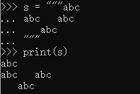

- [0、Python 中的引号](#0python-中的引号)
- [1、](#1)
- [2、](#2)
# 0、Python 中的引号
单引号和双引号都可以用来表示字符串：
```
# 两者没有任何区别
s1 = 'Python'
s2 = "Python"
```
下面的情形，用双引号表示字符串比用单引号更加清晰：
```
s1 = 'We all know that \'A\' and \'B\' are two capital letters.'    # 需要用到转义字符
s2 = "We all know that 'A' and 'B' are two capital letters."
```
下面的情形，用单引号更好：
```
s = 'The teacher said: "Practice makes perfect" is a very famous proverb.'
```
三个双引号可以表示多行注释：
```
"""
这是
一个
多行
注释
"""
```
三个双引号还允许字符串跨行：



# 1、


# 2、