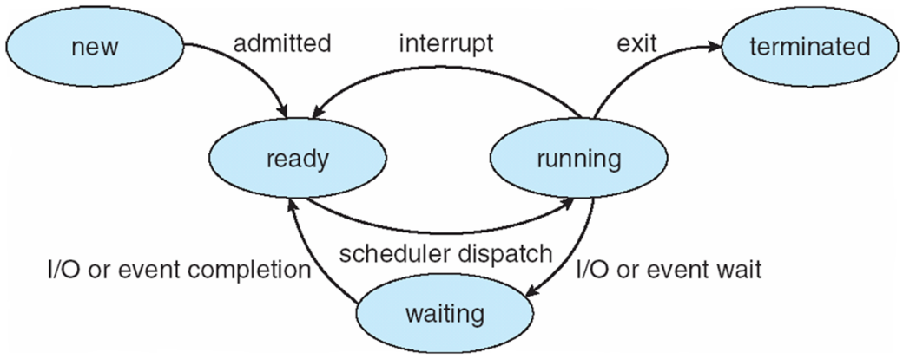

- [0、进程状态转换](#0进程状态转换)
- [1、进程间通信（InterProcess Communication）的几种方式](#1进程间通信interprocess-communication的几种方式)
  - [管道](#管道)
  - [计数信号量](#计数信号量)
  - [共享内存](#共享内存)
  - [消息队列](#消息队列)
  - [Socket](#socket)
- [2、同步/异步、阻塞/非阻塞](#2同步异步阻塞非阻塞)
  - [进程阻塞](#进程阻塞)
  - [非阻塞 I/O 系统调用和异步 I/O 系统调用](#非阻塞-io-系统调用和异步-io-系统调用)
  - [总结](#总结)
# 0、进程状态转换

# 1、进程间通信（InterProcess Communication）的几种方式
## 管道
管道是一种半双工的通信信道，数据只能单向流动。实质是一个缓冲区，进程以先进先出的方式从缓冲区存取数据，可将该缓冲区看做一个循环队列

## 计数信号量
它是一个计数器，用于为多个进程提供共享数据对象的访问。其数值相当于当前可使用的资源数目。进程使用P、V操作来使用、释放资源

## 共享内存
允许两个或多个进程共享一个给定的存储区，这一段存储区可以被两个或两个以上的进程映射至自身的地址空间中，一个进程写入共享内存的信息，可以被其他使用这个共享内存的进程读出。效率高，但是需要互斥信号量来保证读写安全

## 消息队列
...

## Socket
是在应用层和传输层之间的一个抽象层，需要与 IP 地址和 Port 绑定

# 2、同步/异步、阻塞/非阻塞
**同步和异步**关注的是消息通信机制

**阻塞和非阻塞**关注的是程序在等待调用结果（消息，返回值）时的状态

## 进程阻塞
进程发起某个系统调用后，由于该系统调用的操作不能立即完成，需要等待一段时间，于是内核将进程挂起为 `waiting` 状态，以确保它不会被调度执行，占用 CPU 资源

`阻塞` 这个词是与系统调用紧紧联系在一起的，因为要让一个进程进入 `waiting` 状态，要么是它主动调用 `wait()` 或 `sleep()` 等挂起自己的操作，另一种就是进程发起了某个系统调用，而这个系统调用涉及了 I/O 操作，不能立即完成，于是内核先将该进程置为 `waiting` 状态，调度其他进程的运行，等到它所请求的 I/O 操作完成以后，再将其状态改为 `ready`

大部分操作系统默认为用户级应用程序提供的都是阻塞式的系统调用接口，这样使得应用级代码的编写更容易（代码的执行顺序和编写顺序是一致的）

## 非阻塞 I/O 系统调用和异步 I/O 系统调用
这两种类型的系统调用会立即返回，不会等待 I/O 操作的完成，应用程序可以继续执行其他的操作，等到 I/O 操作完成以后，操作系统会通知调用进程（设置一个用户空间特殊变量值，或者触发一个 `signal`，或者产生一个软中断，或者调用应用程序的回调函数）

此处非阻塞 I/O 系统调用和异步 I/O 系统调用的区别是：
* 一个非阻塞 I/O 系统调用 `read()`：操作立即返回的是任何可以立即拿到的数据， 可以是完整的结果， 也可以是不完整的结果， 还可以是一个空值
* 一个异步 I/O 系统调用 `read()`：结果必须是完整的， 但是这个操作完成的通知可以延迟到将来的一个时间点

## 总结
* 在进程通信层面，阻塞/非阻塞和同步/异步基本是同义词，但是要注意区分讨论的对象是发送方还是接收方
* 发送方的阻塞/非阻塞（同步/异步）和接收方的阻塞/非阻塞（同步/异步）是互不影响的
* 在 I/O 系统调用层面，非阻塞 I/O 系统调用和异步 I/O 系统调用存在一定的差别，它们都不会阻塞进程，但是返回结果的方式和内容有所差别