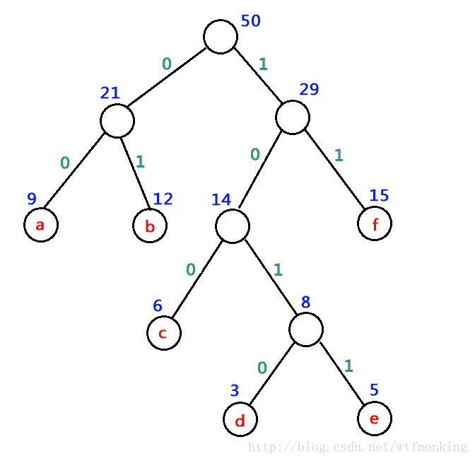

- [0、最长公共子串](#0最长公共子串)
  - [动态规划法](#动态规划法)
- [1、最长公共子序列](#1最长公共子序列)
  - [动态规划法](#动态规划法-1)
- [2、文本串与模式串匹配](#2文本串与模式串匹配)
  - [暴力法](#暴力法)
  - [$KMP$ 算法](#kmp-算法)
- [3、线性时间找 $k$ 大算法复杂度证明](#3线性时间找-k-大算法复杂度证明)
- [4、快速排序算法复杂度证明](#4快速排序算法复杂度证明)
  - [最好情况](#最好情况)
  - [最坏情况](#最坏情况)
- [5、不相邻的组合数](#5不相邻的组合数)
  - [(1) 从 $n$ 个球中选出互不相邻的 $r$ 个球，有多少种取法？](#1-从-n-个球中选出互不相邻的-r-个球有多少种取法)
  - [(2) 从围成一圈的 $n$ 个球中选出互不相邻的 $r$ 个球有多少种取法？](#2-从围成一圈的-n-个球中选出互不相邻的-r-个球有多少种取法)
- [6、哈弗曼树](#6哈弗曼树)
  - [定义](#定义)
  - [哈弗曼编码问题](#哈弗曼编码问题)
# 0、最长公共子串
## 动态规划法
设 $dp[i][j]$ 为以 $s1[i]$ 和 $s2[j]$ 为结尾的公共子串的长度，则：  
* $(1)$ $s1[i] == s2[j]$ 时，$dp[i][j] = dp[i-1][j-1] + 1$
* $(2)$ $s1[i] != s2[j]时，dp[i][j] = 0$

遍历过程中找到的最大值即为最长公共子串的长度

# 1、最长公共子序列
## 动态规划法
设 $dp[i][j]$ 为截至 $s1[i]$ 和 $s2[j]$ 的最长公共子序列的长度，则：
* $(1)$ $s1[i] == s2[j]$ 时，$dp[i][j] = dp[i-1][j-1] + 1$
* $(2)$ $s1[i] != s2[j]$ 时，$dp[i][j] = max\{dp[i-1][j], dp[i][j-1]\}$

遍历过程中找到的最大值即为最长公共子串的长度

# 2、文本串与模式串匹配
## 暴力法
```
// 暴力匹配算法，s 为文本串，p 为模式串
// 匹配成功则返回在s中的位置，匹配失败则返回 -1
// 时间复杂度 O(mn),空间复杂度 O(1)
int BFMatch(char* s, char* p) {
    int sLen = strlen(s);
    int pLen = strlen(p);
    if (pLen > sLen) {
        return -1;
    }
    for (int i = 0; i < sLen-pLen+1; i++) {
        bool matchAtThisPos = true;
        for (int j = 0; j < pLen; j++) {
            if (s[i+j] != p[j]) {
                matchAtThisPos = false;
                break;
            }
        }
        if (matchAtThisPos) {
            return i;
        }
    }
    return -1;
}
```
## $KMP$ 算法
需要先构造一个数组，数组的长度与模式串长度相等，数组含义是模式串从头截至每个下标的子串，其具有相同前后缀的最大长度。规定首字符的相同前后缀的最大长度为 $0$ ，即 $maxLenOfSamePrefixAndSuffix[0] = \{0\}$ ;

$KMP$ 算法的时间复杂度为 $O(m+n)$
```
int KMP(char* s, char* p) {
    int sLen = strlen(s);
    int pLen = strlen(p);
    int maxLenOfSamePrefixAndSuffix[pLen] = {0};
    int j = 0, i = 1;
    // 构造辅助数组的过程
    while (i < pLen) {
        if (p[j] == p[i]) {
            maxLenOfSamePrefixAndSuffix[i] = j + 1;
            i++;
            j++;
        } else {
            if (j == 0) {
                maxLenOfSamePrefixAndSuffix[i] = 0;
                i++;
            } else {
                j = maxLenOfSamePrefixAndSuffix[j-1];
            }
        }
    }
    i = j = 0;
    while (i < sLen-pLen+1) {
        if (s[i+j] == p[j]) {
            j++;
            if (j == pLen) {
                return i;
            }
        } else {
            if (j == 0) {
                i++;
            } else {
                i = i + j - maxLenOfSamePrefixAndSuffix[j-1];
                j = maxLenOfSamePrefixAndSuffix[j-1];
            }
        }
    }
    return -1;
}
```

# 3、线性时间找 $k$ 大算法复杂度证明
设对于$n$个元素的算法复杂度为 $T(n)$，则有：

$T(n) \leq T(\frac{4}{5}n) + an$，其中 $an$ 是找较优主元以及 $partition$ 的开销，$a$ 为常数

$T(\frac{4}{5}n) \leq T((\frac{4}{5}) ^ 2 n) + \frac{4}{5}an$

将 $(2)$ 式代入 $(1)$ 式，得：$T(n) \leq T((\frac{4}{5}) ^ 2 n) + a(n + \frac{4}{5}n)$

$\cdots$

反复代入，可得：$T(n) \leq T((\frac{4}{5}) ^ k n) + a(n + \frac{4}{5}n + (\frac{4}{5})^2n + \cdots + (\frac{4}{5})^kn)$

令$(\frac{4}{5})^kn = 1$，则$T(n) \leq T(1) + a(n + \frac{4}{5}n + (\frac{4}{5})^2n + \cdots + 1)$，对等比数列求和后可得时间复杂度为 $O(n)$

# 4、快速排序算法复杂度证明
## 最好情况
$T(n) = 2T(n/2) + an$，$a$是常数，$an$ 是 $partition$的开销

$T(n/2) = 2T(n/4) + a(n/2)$

代入可得 $T(n) = 4T(n/4) + a(n + n)$

$\cdots$

反复代入可得 $T(n) = 2^kT(1) + kan$，其中 $2^k = n$，即 $k = \log_2{n}$

故 $T(n) = nT(1) + an\log_2{n} = O(nlogn)$

## 最坏情况
$T(n) = T(n-1) + an$，$a$ 是常数，$an$ 是 $partition$ 的开销

$T(n-1) = T(n-2) + a(n-1)$

代入可得 $T(n) = T(n-2) + a[n + (n-1)]$

$\cdots$

反复代入可得 $T(n) = T(1) + a[n + (n-1) + (n-2) + \cdots + 2]$

故 $T(n) = O(n^2)$

# 5、不相邻的组合数
## (1) 从 $n$ 个球中选出互不相邻的 $r$ 个球，有多少种取法？
* $n < 2r-1$ 时，取法为 $0$ 种。例如 $4$ 个球里取 $3$ 个互不相邻的球，找不到这样的组合。

* $n \geq 2r-1$ 时，取法为 $C_{n-r+1}^r$ 种。这里考虑逆向思维，先从 $n-r+1$ 个球中任取 $r$ 个球，取法为 $C_{n-r+1}^r$ 种，然后再另外拿 $r-1$ 个球插到那 $r$ 个球的 $r-1$ 个空位中，这样使得我们原本取出的 $r$ 个球都互不相邻，并且最后总球数为 $n$ 个。不难验证逆向思维得出的情况与正常考虑的情况是一一对应的，故我们可以得到上面的结论。（临界情况： $n=2r-1$ 时，比如 $5$ 个里取 $3$ 个， $7$ 个里取 $4$ 个，此时恰好只有 $C_{n-r+1}^r = C_r^r = 1$ 种取法）

## (2) 从围成一圈的 $n$ 个球中选出互不相邻的 $r$ 个球有多少种取法？
* $n < 2r$ 时，取法为 $0$ 种。例如 $4$ 个球围成一圈，选互不相邻的 $3$ 个球，找不到这样的组合。

* $n \geq 2r$ 时，取法为 $\frac{nC_{n-r}^r}{n-r}$ 种。首先对球进行编号 $1$ 到 $n$ ，对于任何可行的组合，都只有两种情况：包含 $1$ 号球的和不包含 $1$ 号球的：
    * 包含 $1$ 号球：首先选出 $1$ 号球，然后需要从 $3$ 号球到 $n-1$ 号球取出 $r-1$ 个互不相邻的球，根据上面那道题的结论，取法为 $C_{n-3-(r-1)+1}^{r-1} = C_{n-r-1}^{r-1}$ 种
    * 不包含 $1$ 号球：我们需要从 $2$ 号球到 $n$ 号球取出 $r$ 个互不相邻的球，根据上面那道题的结论，取法为 $C_{n-1-r+1}^{r} = C_{n-r}^{r}$ 种
  
    因此，当 $n \geq 2r$ 时，取法总数为 $C_{n-r-1}^{r-1} + C_{n-r}^{r} = \frac{nC_{n-r}^r}{n-r}$ 种。（临界情况：当 $n=2r$ 时，例如 $4$ 个里取 $2$ 个，共有 $\frac{2rC_{r}^r}{r} = 2$ 种）

# 6、哈弗曼树
## 定义
哈弗曼树是带权路径长度（WPL）最短的树，权值较大的结点离根较近

## 哈弗曼编码问题
假设需要对一个字符串用 `01` 字符进行编码，将它转换为唯一的二进制码，要求转换出来的二进制码长度最小。假设原字符串共有 $n$ 种字符，每个字符在字符串中出现的次数为 $W$，其编码长度为 $L$，则编码后二进制码的总长度为 $\sum_{i=1}^{n}{W_iL_i}$，这恰好满足了哈弗曼树的定义。

例如字符串 `aaaabbbbccccdddeeeeffffaaaabbbbcceffffabbbbfffffff`，字符 `a~f` 分别出现了 9、12、6、3、5、15 次，将这些次数作为叶子结点的权重，构建哈弗曼树：



从根节点到叶子结点的路径指明了对应字符的编码